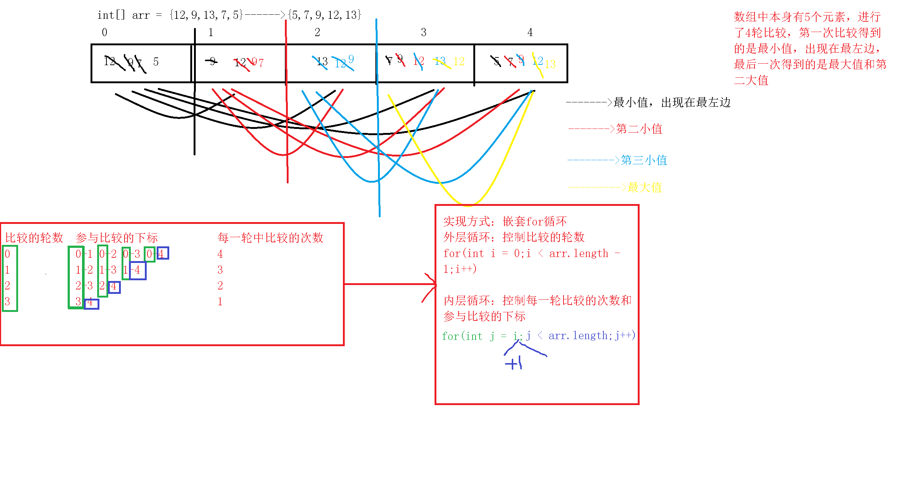
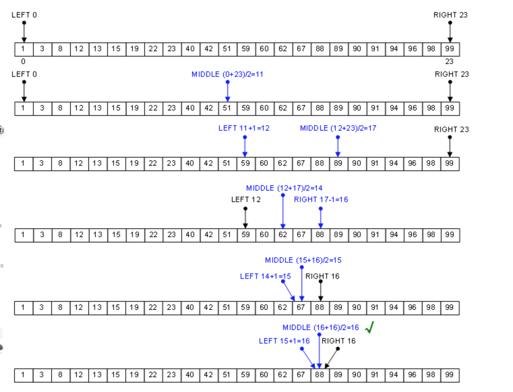

### 数组

#### 回顾

```

```

#### 今天任务

```
1.开发工具eclipse的介绍
2.数组的声明和初始化
3.数组的元素访问以及遍历
4.数组的应用(冒泡排序、选择排序、顺序查找和二分法查找)
5.Arrays工具类的使用
6.可变参数的应用
```

#### 教学目标

```
1.了解eclipse工具的基本使用
2.掌握数组的声明和初始化
3.掌握数组的使用
4.掌握数组的排序和查找
5.了解Arrays工具类的使用
6.了解可变参数的使用
```

#### 第一节 开发工具的介绍	

##### 		1.1 工作空间的概念

```
工作空间（workspace）,是用户在同一个工程中（或者是一个事务）工作环境的集合,简单来说，就是项目存放的位置
就是你项目存放的位置：项目，文件，文件夹
工作空间有明显的层次结构。项目在最顶级，项目里头可以有文件和文件夹
```

##### 		1.2 常用快捷键的介绍

```
ctrl+D：删除一行
ctrl+shift+f：格式化代码
ctrl+S：保存文件
ctrl+shift+o：导包
ctrl+alt+方向键上下键：向上或向下复制
alt+方向键的上下键：向上或向下移动
alt+shift+j：文档注释
ctrl+/：单行注释
ctrl+/：取消单行注释
ctrl+shift+/：多行注释
ctrl+shift+\:取消多行注释
shift+enter：强制向下换行
ctrl+shift+enter 强制向上换行
ctrl+f11:运行
alt+shift+a:矩形选择
```

##### 		1.3 参考资料

```
可参考http://www.runoob.com/eclipse/eclipse-create-java-project.html
```

#### 第二节 数组

##### 2.1 数组的声明	

```
方式一：数据类型[] 数组名		

方式二：数据类型 数组名[] 

推荐使用方式一，C#等越来越多的语言已经不支持方式二定义数组		
```

##### 2.2 数组的初始化

```
Java中的数组必须先初始化，然后才可以使用，所谓初始化，就是为数组中的数组元素分配内存空间，并为每个数组元素赋初始值
```

###### 2.2.1 静态初始化

```
初始化时由程序员指定每个数组元素的初始值，由系统计算数组长度

语法：数组元素类型[] 数组名 = new 数组元素类型[]{元素0，元素1,....};

可简写为：数组元素类型[] 数组名 = {元素0，元素1,....};

说明：任何一个变量都得有自己的数据类型，这里的arr表示数组变量名称，int表示数组中元素的类型，int[]才是数组类型
注意：简写静态初始化只能一条语句完成，不能分割成两条语句。
```

代码实现：

```java
/*
	静态初始化:由我们指定元素的初始值，由系统计算长度或者元素的个数
*/
int[] arr = new int[]{1,56,76,87};
int[] arr1 = {1,56,76,87};

String[] arr2 = new String[]{"434","gfg","gjf545"};
String[] arr3 = {"434","gfg","gjf545"};

//Scanner[] arr4 = 

char[] arr5 = new char[]{'2','g','*'};
char[] arr5 ={'2','g','*'};
```

###### 2.2.2 动态初始化

```
初始化时程序员只指定数组长度，由系统为数组元素分配初始值

语法：元素类型[] 数组名 = new 元素类型[元素个数或者数组长度]；

系统对初始值分配规则如下：a.整数型为0
b.浮点型为0.0
c.字符型为‘\u0000’(不同的系统平台显示结果不同)
d.布尔类型为false
e.引用类型为null
```

代码实现：

```java
		/*
		动态初始化：初始化时由程序员指定数组的长度，系统负责分配元素的初始值
		*/
		int[] array1 = new int[5];//0

		String[] array2 = new String[3];//null

		char[] array3 = new char[10];//\u0000

	
```

```
注意：
	a.在初始化数组时，不要静态初始化和动态初始化同时使用，也就是说，不要在进行数组初始化时，既指定数组的长度，也为每个数组元素分配初始值
	b.既然数组也是一种数据类型，则在初始化的时候也可以先声明，再初始化
		例如：int[] scores;
			 scores = new int[3];
```

##### 2.3 数组的使用

2.3.1  通过下标访问指定元素

```
注意：Java语言的数组索引是从0开始的
```

代码实现：

```java
		//使用静态初始化的方式定义一个数组
		//数组中可以存放重复数据
		int[] arr1 = new int[]{2,65,76,83,32,5,5};

		//1.访问数组中的元素
		//格式：数组名称[下标]    表示获取指定下标所对应的值
		//需求：获取下标3对应的元素
		int num1 = arr1[3];
		System.out.println(num1);//83
		System.out.println(arr1[3]);//83	
```

2.3.2 获取数组元素的个数

```
	在Java中，所有数组都提供了一个length属性，通过这个属性可以访问到数组的长度或者数组中元素的个数
```

代码实现：

```java
		//2.获取数组中的元素个数或者数组的长度
		//格式:数组名称.length;
		int len = arr1.length;
		System.out.println("数组arr1的长度为：" + len);	
```

2.3.3  修改数组元素的值

代码实现：

```java
 		//3.修改数组元素的值
		int num2 = arr1[6];
		System.out.println(num2);//5
		num2 = 100;
		System.out.println(num2);//100
		System.out.println(arr1[6]);//5
		
		//格式：数组名称[下标] = 被修改之后的值
		//注意：不管是静态初始化还是动态初始化，都可以采用这种方式修改元素的值
		arr1[6] = 100;
		System.out.println(arr1[6]);//100
```

2.3.4  遍历数组

```
依次访问数组中的每一个元素，获取每个下标对应的元素值
方式一：简单for循环
方式二：增强for循环（foreach）
```

代码实现：

```java
		//4.遍历数组
		int n0 = arr1[0];
		int n1 = arr1[1];
		int n2 = arr1[2];
		int n3 = arr1[3];
		int n4 = arr1[4];
		int n5 = arr1[5];
		int n6 = arr1[6];

		//1>简单for循环
		//i表示下标，0~arr1.length
		for(int i = 0;i < arr1.length;i++) {
			int n = arr1[i];
			System.out.println(n);
		}

		/*
		2>增强for循环【foreach】
		JDK1.5之后新增的
		优点：用于遍历数组和集合，无需通过数组下标，就可以直接访问数组或者集合中的元素
		语法：
		for(元素数据类型 变量名：数组名称) {
			System.out.println(变量名);
		}
		*/
		//底层工作原理：根据下标获取数组元素
		for(int num : arr1) {
			System.out.println("增强for循环的结果：" + num);
		}

		/*
		两种遍历方式的选择：不需要知道下标，只需要获取元素值，则采用增强for循环
		*/

		//需求：打印下标为偶数的元素值【只能采用简单for循环】
		for(int i = 0;i < arr1.length;i++) {
			if(i % 2 == 0) {
				int n = arr1[i];
				System.out.println(n);
			}
		}
```

2.3.5 数组的内存分配

```
数组引用变量只是一个引用，这个引用变量可以指向任何有效的内存空间，只有当这个引用指向有效的空间时，才可以通过引用去操作真正数组中的元素

结论：数组的引用变量存储在栈空间中，而真正的数组存储在堆空间在中
```

代码实现：

```java
class ArrayUsageDemo04 
{
	public static void main(String[] args) 
	{
		//使用静态初始化的方式初始化一个数组a
		int[] a = {5,7,20};
		System.out.println("a的长度为：" + a.length);//3

		//使用动态初始化的方式初始化一个数组b
		int[] b = new int[4];
		System.out.println("b的长度为：" + b.length);//4

		b = a;
		System.out.println("a的长度为：" + a.length);//3
		System.out.println("b的长度为：" + b.length);//3 

		String[] arr = new String[3];
	}
}
```

画图分析：


```
扩展：基本数据类型和引用数据类型在内存中的区别
思考问题：
	int a = 10;
	int b = a;
	b = 20;
	a = ? -------->10,而且a和b都存储在栈空间中

	int[] x = {22,33};
	int[] y = x;
	y[0] = 55;
	x[0] = ?--------->55,x和y都存储在栈空间中，但是真正的数组存储在堆空间中

扩展：内存的分类
	a.寄存器：最快的存储区域，由编译器根据需求进行自动的分配，我们在程序中无法控制
	b.栈：存放的是基本数据类型的变量以及引用数据类型变量的引用
		特点：被执行之后，该函数或者变量所占用的空间会被销毁【方法压栈】
	c.堆：存放所有使用new关键字创建出来的实体
		特点:执行完不会立即被释放，当使用完成之后，会被标记上垃圾的标识，等待系统的垃圾回收机制来回收它
	d.方法区：
		常量池：存放字符串常量
		静态域：static，静态全局变量
```

2.3.6 使用数组时常见的问题

```
1>数组越界异常：ArrayIndexOutofBoundsException

		出现的时机：当使用了不存在的下标时，则会出现这个错误
		0~length - 1

2>空指针异常：NullPointerException
		出现的时机：当数组的引用变量赋值为null，还在后面的代码中使用这个引用

3>基本数据类型和引用数据类型打印的区别
		int[] arr={10,20,30};
		//System.out.println(arr.toString());
		System.out.println(arr);
		String[] names={"张三","李四","王五"};
		//System.out.println(names.toString());
		System.out.println(names);
		
		int i=10;
		System.out.println(i);
```

代码实现：

```java
class  ArrayUsageDemo03
{
	public static void main(String[] args) 
	{
		//1.数组越界
		int[] arr1 = new int[]{2,65,76,83,32,5,5};
		/*
		Exception in thread "main" java.lang.ArrayIndexOutOfBoundsException: 8
        at ArrayUsageDemo03.main(ArrayUsageDemo03.java:6)
		*/
		//System.out.println(arr1[8]);

		//2.空指针异常
		System.out.println(arr1[3]);
		//arr1 = null;
		/*
		Exception in thread "main" java.lang.NullPointerException
        at ArrayUsageDemo03.main(ArrayUsageDemo03.java:16)
		*/
		//System.out.println(arr1[3]);

		//3.基本数据类型和引用数据类型打印的区别
		int x = 4;
		System.out.println(x);//4
		System.out.println(arr1);//[I@15db9742

		/*
		打印引用数据类型的引用变量时，拿到的是地址

		[I@15db9742

		[ ----- 数组
		I ----- int【Integer】
		@ ------ 地址
		15db9742 ----- 十六进制，地址值的哈希编码【哈希算法】

		打印：
		基本数据类型：数值
		引用数据类型：地址值
		*/

		float[] arr2 = new float[10];
		System.out.println(arr2);//[F@6d06d69c

		String[] arr3 = new String[10];
		System.out.println(arr3);//[Ljava.lang.String;@7852e922
	}
}
```

##### 2.4 数组的排序

2.4.1 冒泡排序	

```
排序思路：比较两个相邻的下标对应的元素，如果符合条件就交换位置（最值出现在最后位）
```

画图分析

代码实现：

```java
class ArraySortedDemo01 
{
	public static void main(String[] args) 
	{
		int[] arr = {23,54,65,3,5,2,87};
		//以升序为例
		//外层循环：控制比较的轮数
		for(int i = 0;i < arr.length - 1;i++) {
			//内层循环：控制每一轮比较的次数和参与比较的下标
			for(int j = 0;j < arr.length - 1 - i;j++) {
				if(arr[j] > arr[j + 1]) {
					//交换位置
					int temp = arr[j];
					arr[j] = arr[j + 1];
					arr[j + 1] = temp;
				}
			}
		}

		for(int num:arr) {
			System.out.println(num);
		}
	}
}
```

2.4.2 选择排序

```
排序思路：固定一个下标，然后拿这个下标对应的值依次和后面的元素进行比较
```

画图分析：



代码实现：

```java
class ArraySortedDemo02 
{
	public static void main(String[] args) 
	{
		int[] arr = {23,54,65,3,5,2,87};
		//以升序为例
		//外层循环：控制比较的轮数
		for(int i = 0;i < arr.length - 1;i++) {
			//内层循环:控制每一轮比较的次数，参与比较的下标
			for(int j = i + 1;j < arr.length;j++) {
				//交换位置
				if(arr[i] > arr[j]) {
					int temp = arr[i];
					arr[i] = arr[j];
					arr[j] = temp;
				}
			}
		}
		
		for(int num:arr) {
			System.out.println(num);
		}
	}
}
```

##### 2.5 数组的查找

2.5.1 顺序查找

```
查找思路：遍历这个数组，依次把每一位元素和要查找的数据进行比较
```

代码实现：

```java
class ArraySearchDemo01
{
	public static void main(String[] args) 
	{
		int[] arr = {23,54,65,3,5,2,87};

		//需求：查找65在数组中的位置
		int key = 65;
		for(int i = 0;i < arr.length;i++) {
			if(key == arr[i]) {
				System.out.println(i);
			}
		}
	}
}
```

2.5.2 二分法查找

```
查找思路：前提是数组是有序（升序或者降序）的，通过折半来缩小查找范围，提高查找效率

将待查找的元素与中间下标对应的元素比较，如果大于中间下标对应的元素，则去右半部分查找
```

画图分析：



代码实现：

```java
class ArraySearchDemo02 
{
	public static void main(String[] args) 
	{
		int[] arr = {12,43,54,65,87,88,90,343};

		//待查找的元素
		int key = 88;

		//相应的下标
		int left = 0;
		int right = arr.length - 1;

		while(left <= right) {
			//中间下标
			int middle = (left + right) / 2;//取整
			if(arr[middle] > key) {
				right = middle - 1;
			} else if(arr[middle] < key) {
				left = middle + 1;
			} else {
				System.out.println(middle);
				break;
			}
		}
	}
}
```

##### 2.6 Arrays工具类

```java
作用：主要用于对数组进行排序，查找，填充，比较等的操作
Arrays工具类存在于java.util包下，所以使用的第一步就是导包：import java.util.Arrays;

注意1：如果在同一个Java文件中同时使用Scanner和Arrays，则可以向如下方式导包：
	  import java.util.Scanner;
      import java.util.Arrays;

	  或者简写为：
      import java.util.*;

注意2：但凡是工具类，类中的方法全部是静态的，方便调用
	  调用语法：类名.方法名（实参列表）
```

代码实现：

```java
//演示Arrays工具类的使用
import java.util.*;
class ArraysUsageDemo 
{
	public static void main(String[] args) 
	{
		//使用动态初始化的方式初始化一个数组
		int[] arr = new int[10];
		
		//1.填充
		/*
		static void fill(int[] a, int val) 
          将指定的 int 值分配给指定 int 型数组的每个元素。 
		static void fill(int[] a, int fromIndex, int toIndex, int val) 
          将指定的 int 值分配给指定 int 型数组指定范围中的每个元素。 

		*/
		/*
		for(int n:arr) {
			System.out.print(n);
		}
		*/
		//Arrays.fill(arr,10);

		//Java但凡涉及到区间问题，一般规律：包头不包尾   前闭后开区间
		Arrays.fill(arr,2,6,56);//0~arr.length - 1


		//2.排序
		/*
		static void sort(int[] a) 
          对指定的 int 型数组按数字升序进行排序。 
		static void sort(int[] a, int fromIndex, int toIndex) 
          对指定 int 型数组的指定范围按数字升序进行排序。 
		*/
		//注意：默认情况下只能进行升序排序
		int[] arr1 = {43,2,65,1,45,9898,989};
		Arrays.sort(arr1);
		//Arrays.sort(arr1,2,5);//[2,5)

		//3.二分法查找
		//前提：必须是排好序的数组
		/*
		static int binarySearch(int[] a, int key) 
          使用二分搜索法来搜索指定的 int 型数组，以获得指定的值。 
		static int binarySearch(int[] a, int fromIndex, int toIndex, int key) 
          使用二分搜索法来搜索指定的 int 型数组的范围，以获得指定的值。 
		*/
		/*
		1
		2
		43
		45
		65
		989
		9898
		*/
		int key = 45;
		int result1 = Arrays.binarySearch(arr1,key);
		System.out.println(result1);//3

		int result2 = Arrays.binarySearch(arr1,20);
		//规律：按照原来的顺序将待查找的元素插入到原数组中的下标，对下标加1然后求相反数
		System.out.println(result2);


		//4.拷贝
		/*
		static int[] copyOf(int[] original, int newLength) 
          复制指定的数组，截取或用 0 填充（如有必要），以使副本具有指定的长度。 
		static int[] copyOfRange(int[] original, int from, int to) 
          将指定数组的指定范围复制到一个新数组。 
		*/
		int[] newArr1 = Arrays.copyOf(arr1,3);

		int[] newArr2 = Arrays.copyOfRange(arr1,2,6);

		//5.将数组转换为字符串
		System.out.println(arr1);//[I@15db9742

		/*
		static String toString(int[] a) 
          返回指定数组内容的字符串表示形式。 
		*/
		System.out.println(Arrays.toString(arr1));//[1, 2, 43, 45, 65, 989, 9898]

		//6.比较数组
		/*
		static boolean equals(int[] a, int[] a2) 
          如果两个指定的 int 型数组彼此相等，则返回 true。 
		*/
		/*
		如果两个指定的 int 型数组彼此相等，则返回 true。
		如果两个数组包含相同数量的元素，并且两个数组中的所有相应元素对都是相等的，则认为这两个数组是相等的。
		换句话说，如果两个数组以相同顺序包含相同的元素，则两个数组是相等的。
		此外，如果两个数组引用都为 null，则认为它们是相等的
		*/
		int[] array1 = {1,54,76};
		int[] array2 = {1,54,76};
		System.out.println(Arrays.equals(array1,array2));//true
		System.out.println(array1 == array2);//false

		/*
		总结：
		==和equals
		==：是一个运算符，可以比较基本数据类型和引用数据类型【当比较引用数据类型的时候，比较的地址值】
			比较String类型的变量，采用equals   
			String str1 = "";
			String str2 = "";
			比较方式：str1.equals(str2);
		equals：是一个方法，只能比较引用数据类型
		【补充：如果equals方法在一个类中没有没重新实现，则equals方法的作用和==一样，都比较的是地址值
		如果equals方法在一个类中被重新实现，则比较的是内容
		】
		*/

		for(int n:newArr1) {
			System.out.println(n);
		}
	}
}
```

##### 2.7 可变参数                    

```
不定长参数

	在设计方法时，方法的形参的个数是不确定的

	语法
	类型... 变量名称
	例如：int... num
```

代码实现：

```java
//演示不定长参数的使用
class PramaUsageDemo 
{
	public static void main(String[] args) 
	{
		int result = add(2,5,65,76,87,98,9);
		System.out.println(result);

		//2.对于一个方法的参数是不定长参数时，实参可以直接传一个数组
		int[] arr = {2,5,65,76,87,98,9};
		System.out.println(add(arr));//num = arr;

		text1(10,"hello",1,545,656);
		//text1(1,545,656,"hello");
	}

	//需求：计算不确定个整数的和
	public static int add(int... num) {
		//1.不定长的参数在进行使用的时候被当做数组来进行处理
		//num其实就相当于一个数组的引用变量
		int sum = 0;
		for(int n :num) {
			sum += n;
		}

		return sum;
	}

	//3.不定长参数在使用的时候，必须出现在参数列表的最后一个
	//4.在同一个参数列表中，不定长参数只能出现一次
	public static void text1(int num1,String s,int... num) {
	}
}
```

```java
注意：

a.不定长的参数在进行使用的时候被当做数组来进行处理
b.不定长参数在使用的时候，必须出现在参数列表的最后一个
c.对于一个方法的参数是不定长参数时，实参可以直接传一个数组
```

#### 总结

```java
1.熟练掌握eclipse的基本使用
2.熟练掌握数组的基本用法
3.熟练掌握数组的排序和查找方式
4.了解Arrays工具类和可变参数的使用
```

#### 课前默写

```
1.使用if语句实现判断一个数是否是5的倍数
2.根据键盘输入的数字，打印对应的星期（注：可以不全写）
3.求50~200之间所有整数的和
```

#### 作业

```java
初级
1.定义一个函数，获取某个数组中的最小值
2.定义一个数组,数组成员10个,找出数组中最大数连同下标一起输出
3.给定一个整型数组，数组成员10个,求该数组中第二大的数的下标
4.B哥去参加青年歌手大奖赛,有10个评委打分,(去掉一个最高一个最低)求平均分?
5.利用选择排序对数据进行降序排序
6.定义数组，存放5个学生的成绩【成绩值自己设定】，将成绩从大到小排序，获得成绩之和，平均成绩，最小成绩，最大成绩。
7.定义一个长度为10的int数组,统计数组中的最大值、最小值、以及奇数和偶数的个数
8.提取一个方法，将指定数组中的数组元素进行反转
例如：{10,23,2,45,6}--->{6,45,2,23,10}
9.设计一个工具类，在工具类中设计以下方法：
	1）计算两个数的乘积，当这两个数都不为0时正常计算，若有一个数为0那么在方法中声明一个运行时异常（提示：结果为0）
	2）计算两个字符串所表示的整数的和，先判断字符串是否表示整数，若表示整数计算机过并输出，若字符串不表示整数在方法中声明一个非运行是异常（提示：字符串不能表示整数）
	3）将两个Object对象连接在一起返回字符串，若这两个对象是包装类对象或字符串则将这两个对象连接，否则在方法中声明一个非运行是异常（提示：这两个对象不能链接）

中级
1.将一个数组逆序输出
2.输入数组，最大的与第一个元素交换，最小的与最后一个元素交换，输出数组
3.有一个已经排好序的数组。现输入一个数，要求按原来的规律将它插入数组中
```

#### 面试题

```java
1.基本数据类型和引用数据类型之间的区别
2.在java中，声明一个数组过程中，是如何分配内存的
3.数组的静态和动态初始化有什么不同
4.分别使用冒泡和选择对已知数组进行排序
```

