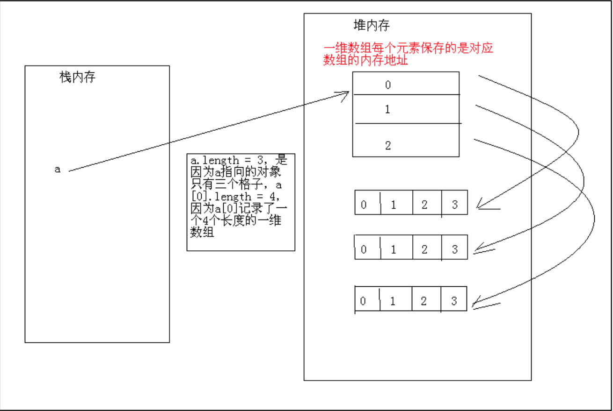

### 二维数组和异常

#### 回顾

```
1.数组的初始化方式
2.数组的使用（元素访问，元素修改，遍历）
3.数组的应用（排序和查找）
4.选择排序、冒泡排序、顺序查找和二分法查找的算法以及代码实现
5.Arrays工具类中的常用方法
6.可变参数使用过程中的注意事项
```

#### 今天内容

```java
1.二维数组
 1.1 二维数组的概念
 1.2 二维数组的定义
 1.3 数组的初始化
 1.4 二维数组的访问
2.异常
 2.1 异常的概念
 2.2 异常的分类
 2.3 异常的处理方式
 2.4 自定义异常类
```

#### 教学目标

```java
1.了解二维数组的概念和定义
2.掌握二维数组的初始化和遍历
3.了解异常的概念和分类
4.掌握异常的处理方式
5.了解自定义异常的使用
```

#### 第一节 二维数组

##### 1.1 二维数组的概念

```
本质上还是一个一维数组，只是其数组元素又是一个一维数组
	
	举例说明:变量，一维数组，二维数组之间的关系
	吸烟：
	没钱 	 	1根		 一个变量
	稍微有钱  一包	   一维数组【20根】	
	有钱	    一条		二维数组【10包】
```

##### 1.2 二维数组的定义

```
	方式一：元素类型[][] 数组名称；

	方式二：元素类型 数组名称[][]；
	推荐使用方式一
```

##### 1.3 数组的初始化

```
	静态初始化：

	语法：元素类型[][] 数组名称 = new 元素类型[][]{{一维数组1,一维数组2,一维数组3....};
	简化：元素类型[][] 数组名称 =m{{一维数组1,一维数组2,一维数组3....};

	举例：int[][] arr = new int[][]{{2,3},{5,2,1},{10,45,22,54}};
	      int[][] arr = {{2,3},{5,2,1},{10,45,22,54}};

	动态初始化：

	语法：元素类型[][] 数组名称 = new 元素类型[二维数组的长度][一维数组的长度]
	举例：int[][] arr = new int[3][4];
	说明：定义一个数组arr，二维数组中一维数组的个数为3个，每个一维数组中元素的个数为4个
```

##### 1.4 二维数组的访问

通过下标访问指定元素

```java
class TwiceArrayDemo01 
{
	public static void main(String[] args) 
	{
		int[][] arr = new int[3][4];

		System.out.println(arr);//[[I@15db9742
		System.out.println(arr.length);//3
		System.out.println(arr[0]);//[I@6d06d69c
		System.out.println(arr[0].length);//4
		System.out.println(Arrays.toString(arr));//[[I@6d06d69c, [I@7852e922, [I@4e25154f]
		System.out.println(Arrays.toString(arr[0]));//[0, 0, 0, 0]

		/*
		[[I@15db9742
		3
		[I@6d06d69c
		4
		[[I@6d06d69c, [I@7852e922, [I@4e25154f]
		[0, 0, 0, 0]
		*/
	}
}
```

遍历数组      

```java
//常见的操作：遍历二维数组
class TwiceArrayDemo02 
{
	public static void main(String[] args) 
	{
		//如果二维数组中一维数组的元素个数不确定
		//int[][] arr = new int[3][];

		int[][] arr = new int[][]{{2,3},{5,2,1},{10,45,22,54}};

		//遍历arr
		for(int i = 0;i < arr.length;i++) {
			System.out.println(arr[i]);
		}

		//赋值：给arr中的第1个元素修改值
		arr[1] = new int[2];

		//给arr[0]中的第0个元素修改值
		arr[0][0] = 10;

		//遍历arr[0]
		for(int i = 0;i < arr[0].length;i++) {
			System.out.println(arr[0][i]);
		}

		//二维数组的遍历：嵌套for循环
		//简单for循环
		for(int i = 0;i < arr.length;i++) {
			int[] subArr = arr[i];
			for(int j = 0;j < subArr.length;j++) {
				System.out.println(subArr[j]);
			}
		}

		//增强for循环
		for(int[] subArr1:arr) {
			for(int n:subArr1) {
				System.out.println(n);
			}
		}
	}
}
```

##### 1.5 内存中的二维数组

画图分析：



#### 第二节 异常

#####2.1 异常的概念

```
生活中面对各种异常，比如堵车、撞车等，通常会怎样处理，根据不同的异常进行相应的处理，而不会就此中断我们的生活。
程序中异常：在程序执行过程中由于设计或设备原因导致的程序中断的异常现象叫做异常。
异常处理：Java编程语言使用异常处理机制为程序提供了错误处理的能力。
```

异常演示：

```java
public class Test1 {
	public static void main(String[] args) {
		Scanner in = new Scanner(System.in);
		System.out.print("请输入被除数:");
		int num1 = in.nextInt();
		System.out.print("请输入除数:");
		int num2 = in.nextInt();
		System.out.println(num1/num2);
		System.out.println("感谢使用本程序！");
	}
}
```


#####2.2 异常的分类

运行时异常

```
运行时异常：（RuntimeException）在编译过程不会发现（没有语法错误），但是在执行程序程中，由于重大的逻辑错误导致的程序中断。
所有的RuntimeException的子类包括RuntimeException都属于运行是异常
```

常见的运行时异常

```java
NullPointerException		空指针异常（一个对象没有初始化调用方法）
IndexOutOfBoundsException	下标越界异常
ClassCastException			类型转换异常（对象类型转换时）
NumberFormatException		数字格式异常
ArithmeticException			算术异常
```
非运行时异常（编译时异常）

```
非运行时异常：编译异常或检查异常，在程序设计过程中，编译时就会被发现，但是执行时可能发生也可能不发生的异常，为了程序不报错可以执行，那么这一类异常必须进行相应的处理
Exception的子类，除了RuntimeExcption之外都属于编译时异常。

```

Exception类：异常的父类。

Error类：错误，错误比较严重的问题，不属于异常，程序猿无法处理。

#####2.3 异常处理

Java的异常处理是通过5个关键字来实现的：

* try：执行可能产生异常的代码 
* catch：捕获异常 ，并处理
* finally：无论是否发生异常，代码总能执行
* throw： 手动抛出异常 
* throws：声明方法可能要抛出的各种异常

###### 2.3.1 try-catch块

使用try-catch块捕获异常，分为三种情况

第一种情况：正常情况

```java
public void method(){
      try
            // 代码段(此处不会产生异常)
      }catch(异常类型ex){
            // 对异常进行处理的代码段
      }
	 //代码段
}
```

第二种情况：出现异常

```java
public void method(){
      try {
            // 代码段 1
            // 产生异常的代码段 2
            // 代码段 3
      } catch (异常类型 ex) {
            // 对异常进行处理的代码段4
      }
	 // 代码段5
}
```

printStackTrace()：此方法用来显示异常信息。

第三种情况：异常类型不匹配

```java
public void method(){
    try {
         // 代码段 1
         // 产生异常的代码段 2
         // 代码段 3
    } catch (异常类型 ex) {
         // 对异常进行处理的代码段4
    }
	// 代码段5
}
	
```

###### 2.3.2 try-catch-finally

在try-catch块后加入finally块

​	(1)是否发生异常都执行

​	(2)不执行的唯一情况,退出java虚拟机，System.exit(); 0正常退出，非0非正常退出

```java
public void method(){
    try {
         // 代码段 1
         // 产生异常的代码段 2
    } catch (异常类型 ex) {
       // 对异常进行处理的代码段3
         return;
    }finally{
          // 代码段 4
    }
}
		
```

###### 2.3.3 多重catch块 

引发多种类型的异常

​	(1)排列catch 语句的顺序：先子类后父类 

​	(2)发生异常时按顺序逐个匹配

​	(3)只执行第一个与异常类型匹配的catch语句


```java
public void method(){
    try {
         // 代码段
         // 产生异常(异常类型2)
    } catch (异常类型1 ex) {
         // 对异常进行处理的代码段
    } catch (异常类型2 ex) {
         // 对异常进行处理的代码段
    } catch (异常类型3 ex) {
         // 对异常进行处理的代码段
    }
    // 代码段
}		
```

###### 2.3.4 try…finally

try…finally不能捕获异常 ，仅仅用来当发生异常时，用来释放资源。

```java
public void method(){
    try {
         // 代码段 1
         // 产生异常的代码段 2
    }finally{
          // 代码段 3
    }
}
```


###### 2.3.5 声明异常

如果在一个方法体中抛出了异常，如何通知调用者？

throws关键字：声明异常

```java
public static void divide() throws Exception {
		  //可能出现异常的代码
}
public static void main(String[] args) {
		 try {
			divide();
		 } catch (Exception e) {
			e.printStackTrace();
		 }
}
或
public static void main(String[] args) throws Exception {
	 divide();
}
```

###### 2.3.6 抛出异常

除了系统自动抛出异常外，有些问题需要程序员自行抛出异常。

throw关键字：抛出异常

```java
public class Person {
	private String name = "";   // 姓名
	private int age = 0;   // 年龄
	private String sex = "男";  // 性别
	public void setSex(String sex) throws Exception {
		if ("男".equals(sex) || "女".equals(sex))
			this.sex = sex;
		else {
			throw new Exception(“性别必须是\"男\"或者\"女\"！");
		}
	}
}
```

上机练习1

在setAge(int age)中对年龄进行判断，如果年龄介于1到100直接赋值，否则抛出异常

在测试类中创建对象并调用setAge(int age)方法，使用try-catch捕获并处理异常


#####2.4 自定义异常类

创建自定义异常，通常继承自Exception 或其子类，习惯上包装一下父类的构造方法。

```
1.过程：自定义非运行时异常

	i.定义一个类，继承Exception类

    ii.在此类中定义构造方法，调用父类中的带字符串参数的构造方法（此字符串表示对异常的描述）

	iii.使用异常
```

```java
public class ZDYException extends Exception {	
	public ZDYException() {}
	//此构造方法中的字符串参数表示对此异常的说明描述
	public ZDYException(String masage) {
		super(masage);
	}
}
public class TestZDYException {
	public static void main(String[] args) throws ZDYException {
		check("123456");
	}
	//设计一个方法，完成邮箱格式的初步验证（判断传入的字符串是否包含@符）
	//若字符串包含@返回true，否则返回false并抛出自定义异常
	public static void check(String email){
		if(email.contains("@")) {
			System.out.println(true);
		}else {
			System.out.println(false);
			try {
				throw new ZDYException("没有@符");
			} catch (ZDYException e) {
				// TODO Auto-generated catch block
				e.printStackTrace();
			}
		}
	}
}
```

```
2.自定义运行时异常：

	i.定义一个类，继承RuntimeException类
	ii.在此类中定义构造方法，调用父类中的带字符串参数的构造方法（此字符串表示对异常的描述）
	iii.使用异常
```

```java
public class ZDYRuntime extends RuntimeException {	
	public ZDYRuntime() {}
	public ZDYRuntime(String masage) {
		super(masage);
	}
}
public class TestZDYRuntime {
	public static void main(String[] args) {
		throw new ZDYRuntime("hello");
	}
}
```

#### 总结

1 二维数组，实际上是由一维数组组成，一维数组的每个元素还是一个数组。

2 二维数组的声明、初始化、访问(通过下标访问，遍历)

3  异常：程序运行过程出现的不正常的现象叫异常。

异常分类：运行时异常 和编译时异常

常见运行时异常： NullPointerException  ClassCastException  ArithmeticException  IndexOutofBoundsException  NumberFormaterException  InputMismatchException

4  异常处理：	

​	try: 包含可能发生异常的代码

​       catch:捕获异常，并处理异常

​        finally: 释放资源，有没有发生异常都会执行, jvm虚拟机退出了，不会执行

​        throws：声明异常，告诉调用者，此方法会发生异常，声明编译时异常

​        throw：抛出异常，程序员主动抛出异常。

使用形式:

​	try ... catch( Exception e){...}  捕获异常，并处理异常

​       try... catch(Exception e) {....} finally{....} 捕获异常，并处理异常，释放资源

​      多重catch  , 处理异常更加精确。 子类再前面，父类在后面

​     try...finally{...}  释放资源，不能处理异常。 

 5 自定义异常：

​	继承Exception或RuntimeException，一般继承 RuntimeException，包装父类的构造方法。   

#### 默写

```java
根据下面要求完成题目：
1.分别使用静态初始化和动态初始化的方式定义一个数组
2.对静态初始化的数组分别使用冒泡和选择进行排序，其中，冒泡实现升序，选择实现降序
3.使用for循环和foreach遍历排好序的数组
```

####作业

```java
1.自定义一个运行时异常
2.班上有3个学生，每个学生都参加了三门功课的考试，其中第二个学生是特长生，上级要求给他每门功课都+5.【要求：使用二维数组做，并且分别使用for循环和增强for循环遍历二维数组】
3.求一个3*3矩阵对角线元素之和
```

####面试题

```java
1.二维数数组在内存中的存储方式是怎样的？
2.什么是异常？常见的异常有哪些？
3.异常有哪些处理方式，分别需要注意什么问题？
4.try-catch块中存在return语句，是否还执行finally块，如果执行，说出执行顺序
```