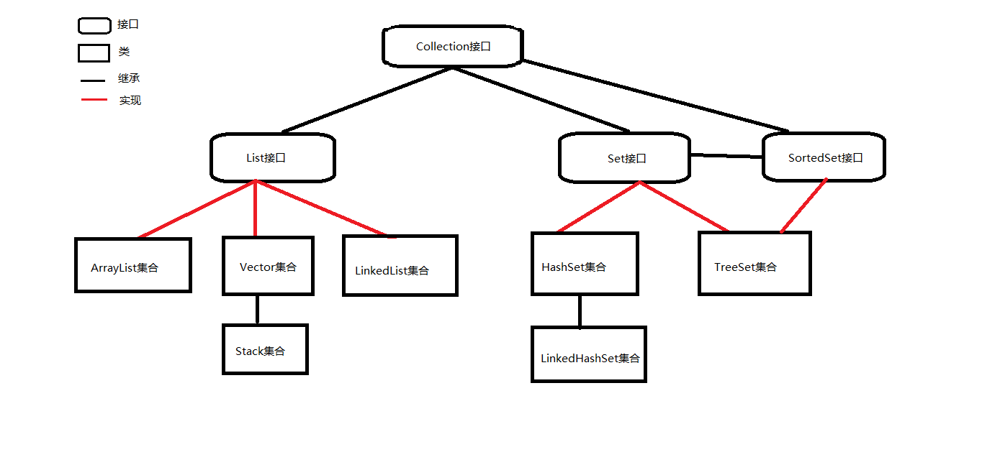
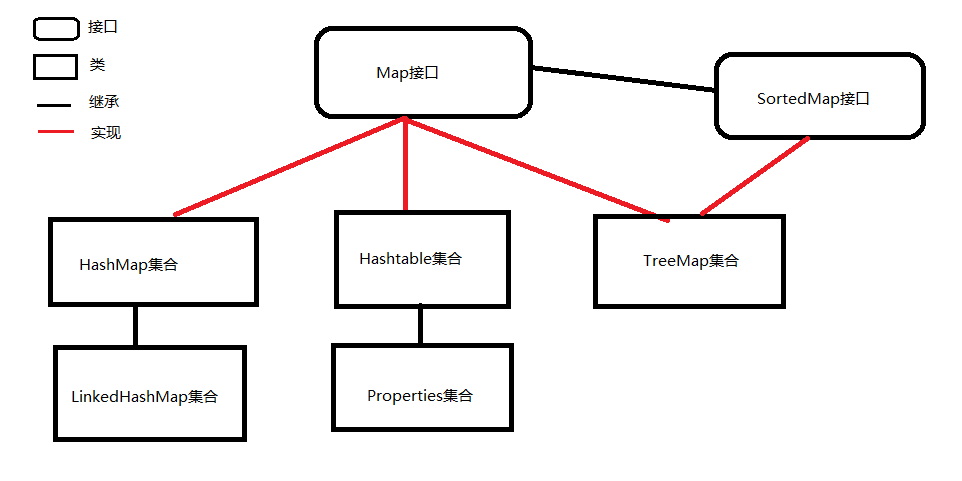
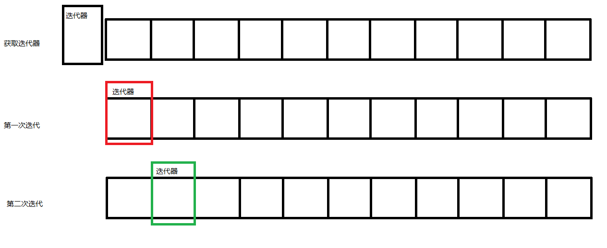

###集合

#### 回顾

```

```

#### 今天任务

```
1.概念
	1.1 集合的概念
	1.2 集合的框架结果介绍
	1.3 集合和数组的对比
2.Collection接口
	2.1 Collection中常用的方法
3.泛型
	3.1 什么是泛型
	3.2 泛型的声明
	3.3 说明
	3.4 泛型使用时的注意事项
	3.5 受限泛型
	3.6 泛型应用在集合上
4.Iterator迭代器
	4.1 迭代器的工作原理
	4.2 迭代器的使用
5.List接口
	5.1 List接口的存储特点
	5.2 List接口的实现类
```

#### 教学目标

```
1.掌握集合的概念以及和数组的对比
2.了解集合的框架
3.了解Collection接口中的常用方法
4.了解泛型的使用及注意事项
5.掌握Iterator的工作原理以及使用
6.掌握List接口的存储特点
7.掌握ArrayList的使用
8.了解LinkedList、Vector和Stack的使用
```

#### 第一节 概念

#####1.1 集合的概念

```
集合与数组一样，也是一个容器，与数组不同的是，数组长度固定，集合的长度不定，可以无限的想集合中添加元素，而且集合中存储的元素类型可以随意，只能是引用类型。
```

#####1.2 集合的框架结构介绍

> Collection集合的框架结构



> Map集合的框架结构



#####1.3 集合与数组的对比

相同点：

```
都是数据的容器，在一个数组或集合中可以存储多个数据
```

 不同点：
```
元素：数组中的元素只能是相同，集合中的元素是任意的（泛型）
      数组中可以存储基本类型和引用类型，集合只能存储引用类型

长度(元素个数)：
	数组是定长的，一旦初始化长度就不可以修改
	集合长度可以修改，可以删除元素和添加元素
```
####第二节 Collection接口

#####2.1 Collection中常用的方法
| 方法名                               | 描述                                       |
| --------------------------------- | ---------------------------------------- |
| add(E e)                          | 确保此 collection 包含指定的元素（可选操作）。            |
| addAll(Collection<? extends E> c) | 将指定 collection 中的所有元素都添加到此 collection 中（可选操作）。 |
| clear()                           | 移除此 collection 中的所有元素（可选操作）。             |
| contains(Object o)                | 如果此 collection 包含指定的元素，则返回true。          |
| containsAll(Collection<?> c)      | 如果此 collection 包含指定 collection 中的所有元素，则返回 true。 |
| equals(Object o)                  | 比较此 collection 与指定对象是否相等。                |
| isEmpty()                         | 如果此 collection 不包含元素，则返回true。            |
| iterator()                        | 返回在此 collection 的元素上进行迭代的迭代器。            |
| remove(Object o)                  | 从此 collection 中移除指定元素的单个实例，如果存在的话（可选操作）。 |
| removeAll(Collection<?> c)        | 移除此 collection 中那些也包含在指定 collection 中的所有元素（可选操作）。 |
| retainAll(Collection<?> c)        | 仅保留此 collection 中那些也包含在指定 collection 的元素（可选操作）。 |
| size()                            | 返回此 collection 中的元素数。                    |
| toArray()                         | 返回包含此 collection 中所有元素的数组。               |
上机练习1

```java
		//1创建Collection对象
		Collection collection=new ArrayList();
		//2操作
		//2.1添加
		collection.add("张三");
		collection.add("李四");
		collection.add("他二大爷");
		collection.add("他老爷");
		collection.add("七大妈");
		collection.add("张三");
		System.out.println("集合的元素个数:"+collection.size());
		//2.2删除
		//2.2.1删除一个
//		collection.remove("张三");
//		System.out.println("删除之后的数据个数:"+collection.size());
		//2.2.2清空
//		collection.clear();
//		System.out.println("清空之后:"+collection.size());
		
		//3遍历
		//3.1 使用增强for
		System.out.println("--------使用增强for遍历----------");
		for(Object obj:collection){
			System.out.println(obj);
		}
		//3.2使用迭代器
		System.out.println("-------使用迭代器---------");
		Iterator it=collection.iterator();
		while(it.hasNext()){
			Object obj=it.next();
			System.out.println(obj);
		}
		//4判断
		//4.1判断是否存在
		boolean b=collection.contains("王五");
		boolean b2=collection.contains("他老爷");
		System.out.println(b);
		System.out.println(b2);
		//4.2判断是否为空
		System.out.println(collection.isEmpty());
	
		//5查找
		
		//6其他方法
		Collection c1=new ArrayList();
		c1.add("中国");
		c1.add("朝鲜");
		Collection c2=new ArrayList();
		c2.add("中国");
		c2.add("朝鲜");
		System.out.println("c1.equals(c2):"+c1.equals(c2));
		System.out.println("c1==c2:"+(c1==c2));
```

上机练习2

```java
		Collection collection=new ArrayList();
		//1添加
		collection.add(111);//111自动装箱 new Integer(111)
		collection.add(222);
		collection.add("111");
		collection.add("222");
		//2删除
		System.out.println("元素的个数:"+collection.size());
		System.out.println("删除之前:"+collection);
		collection.remove("111");
		System.out.println("删除之后:"+collection.size());
		System.out.println("删除之后:"+collection);
		//3遍历
		//3.1增强for循环
		System.out.println("增强for.....");
		for (Object object : collection) {
			System.out.println(object);
		}
		//3.2使用迭代器
		System.out.println("迭代器.....");
		Iterator it=collection.iterator();
		while(it.hasNext()){
			Object obj=it.next();
			System.out.println(obj);
		}
```


####第三节 泛型

##### 3.1 什么是泛型

```java
泛型就是可以表示一个广泛数据类型的类型参数（泛型只能表示引用类型）,把数据类型作为参数来传递。
形式参数：声明方法时，在方法的参数列表中声明，而且在方法体中会使用到，但是是一个未知的数据
类型参数：在一个类中声明一个未知的数据类型，在类中可以使用这个类型，但是具体类型取决于实例化时传入的实际类型
```

##### 3.2 泛型的声明

```java
1）泛型可以声明在方法中：(泛型方法)
public static <标识符> void fun(){}

2）泛型可以声明在类中：（泛型类）
public class 类名<标识符>{
	//类体
	//泛型可以在类中充当成员变量
	//泛型可以再类中充当方法的返回值
	//泛型可以在类中充当方法的参数
}

3）泛型可以声明在接口中：（泛型接口）
public interface 接口名<标识符>{
	//成员
	//泛型可以充当接口中方法的返回值
	//泛型可以充当接口中方法的参数
}
```

##### 3.3 说明

```java
1）标识符(占位符)：只要是一个合法的标识符即可，一般情况下，只使用一个大写字母表示泛型
例：public class Person<T>{} E(Element)  K(key)  V(value)
2）泛型的类型与声明的类或接口不需要有任何的关系
3）泛型可以在类中充当任何的成员
4）泛型具体类型取决于实例化对象时传入的实际类型
```

##### 3.4 泛型使用时的注意事项

```java
1）泛型不能在类中声明静态属性、常量
final修饰的属性必须在声明的同时初始化，所以泛型不能声明常量
static修饰的属性是静态属性，先于对象，泛型类型取决于创建对象时传入的实际类型，所以泛型不能声明静态属性
综上所述：不能使用泛型声明静态属性、常量

2）泛型不能在类中初始化数组，但是可以声明数组
初始化数组时需要给元素进行分配空间,但是泛型类型不确定无法分配空间

3）在类中不能使用泛型声明参数个数相同的重载方法
当一个类中有两个泛型时，创建对象时，两个泛型使用相同类型替换，那么重载方法就是相同的方法（同名，参数列表也相同）

4）使用不同实际类型创建出的泛型类对象的引用不可以相互赋值
```

##### 3.5 受限泛型(理解即可)

```java
1）<?>：表示任意类型
2）<? extends T>：表示T类或者T类的子类
3）<? super T>：表示T类或者T类的父类
```
#####3.6 泛型应用在集合上                   

```java
泛型在集合中应用，表示的是集合中元素的类型
```

####第四节 Iterator迭代器

#####4.1 迭代器的工作原理

```
迭代器相当于一个游标，最初获取迭代器时，迭代器的位置在所有元素的前面，每迭代一个元素，迭代器向后移动一个位置
```



#####4.2 迭代器的使用       

| 方法名       | 描述                                       |
| --------- | ---------------------------------------- |
| hasNext() | 判断迭代器是否存在下一个元素可以迭代器                      |
| next()    | 迭代器迭代下一个元素                               |
| remove()  | 从迭代器指向的 collection 中移除迭代器返回的最后一个元素（可选操作）。 |

####第五节 List接口

| 方法名                                      | 描述                                       |
| ---------------------------------------- | ---------------------------------------- |
| add(int index, E element)                | 在列表的指定位置插入指定元素（可选操作）。                    |
| addAll(int index, Collection<? extends E> c) | 将指定 collection 中的所有元素都插入到列表中的指定位置（可选操作）。 |
| containsAll(Collection<?> c)             | 如果列表包含指定 collection 的所有元素，则返回true。       |
| get(int index)                           | 返回列表中指定位置的元素。                            |
| indexOf(Object o)                        | 返回此列表中第一次出现的指定元素的索引；如果此列表不包含该元素，则返回 -1。  |
| lastIndexOf(Object o)                    | 返回此列表中最后出现的指定元素的索引；如果列表不包含此元素，则返回 -1。    |
| listIterator()                           | 返回此列表元素的列表迭代器（按适当顺序）。                    |
| remove(int index)                        | 移除列表中指定位置的元素（可选操作）。                      |
| set(int index, E element)                | 用指定元素替换列表中指定位置的元素（可选操作）。                 |
| subList(int fromIndex, int toIndex)      | 返回列表中指定的 fromIndex（包括 ）和 toIndex（不包括）之间的部分视图。 |

#####5.1 List接口的存储特点

```
相对有序存储，可以存储相同元素（不排重），可以通过下标访问集合元素
List接口中可以使用独有的迭代器ListIterator，具有反向遍历的功能
```

#####5.2 List接口的实现类

5.2.1 ArrayList类

```java
ArrayList类是List接口的大小可变数组的实现。实现了所有可选列表操作，并允许包括null在内的所有元素。

存储特点：
	相对有序存储，可以存储相同元素（不排重），可以通过下标访问集合元素，通过数组实现的集合
```

代码实现：

```java
public class ArrayListDemo {
         	public static void main(String[] args) {
              	//创建一个ArrayList集合
            	ArrayList<String> list = new ArrayList<>();//构造方法中的泛型可以省略
              	list.add("zhangsan");//向集合中添加元素
              	list.add("lisi");
              	list.add("wangwu");
              	System.out.println(list.isEmpty());//判断list集合是否为空集合
              	System.out.println(list.size());//查看集合中元素的个数
              	System.out.println(list.get(1));//获取集合中下标为1的元素
              	System.out.println(list.set(1,"zhaoliu"));//修改集合中下标为1的元素
              	System.out.println(list.contains("wangwu"));//查看"wangwu"是否是集合中的元素
              	list.remove("wangwu");//删除集合中"wangwu"元素
              	list.remove(1);//删除集合中下标为1的元素
              	//for循环遍历集合
                for(int i=0; i<list.size(); i++){
                  System.out.println(list.get(i));
                }
              	//使用Iterator迭代器遍历
              	Iterator<String> it = list.iterator();//获取迭代器
                while(it.hasNext()){
                  System.out.println(it.next());
                }
              	//使用ListIterator迭代器遍历
              	ListIterator<String> lit = list.listIterator();
                while(lit.hasNext()){
                  System.out.println(lit.next());
                }
              	//反向遍历
                while(lit.hasPrevious()){
                  System.out.println(lit.previous());
                }
         }
}
```

5.2.2 LinkedList类

```java
LinkedList类是List接口的链接列表实现。实现所有可选的列表操作，并且允许所有元素（包括null）。
存储特点：
	相对有序存储，可以存储相同元素（不排重），可以通过下标访问集合元素，通过链表实现的集合

LinkedList集合适用在对元素插入和删除操作较频繁的时候
ArrayList集合适用在对元素查询操作较频繁的时候
```

5.2.3 Vector

```java
Vector类可以实现可增长的对象数组。与数组一样，它包含可以使用整数索引进行访问的组件。但是Vector
的大小可以根据需要增大或缩小，以适应创建 Vector后进行添加或移除项的操作。
```

5.2.4 Stack

```java
Stack类表示后进先出（LIFO）的对象栈。是Vector的子类。
```

5.2.5 ArrayList与LinkedList，Vector三种实现类存储的比较

```java
a.在用法上和ArrayList完全相同【Vector就是ArrayList的前身】
b.底层存储结构：ArrayList是数组，LinkedList是链表，Vector是数组
c.Vector是一个古老的集合，从JDK1.0开始就有了，Vector存在一些方法名比较长的方法，xxxxElement
d.Vector是线程安全的，效率低，ArrayLIst是线程不安全的，效率高，推荐使用ArrayList【Collections工具类中有相应的方法可以将ArrayList改为线程安全的】
e.ArrayList查找遍历比较快，LinkedList插入删除比较快
```

#### 总结

```
1 集合概念，用来存储一组数据的容器，和数组类似，数组是长度固定的，集合长度可以变化。
2 Collection接口，父接口， add()  remove()  clear()  contains()  iterator()
3 Collection有两个子接口 List和Set
4 泛型：本质使用数据类型作为参数传递
	4.1 定义泛型类  泛型方法 泛型接口
	4.2 使用 创建类对象，指定泛型的实际类型
	4.3 泛型限制，<?> 表示任何类型  
	             <? extends T> 表示泛型上限， T类型或T的子类 
	             <? super T> 表示泛型下限，T类型或T的父类
5 Iterator迭代器
        hasNext();
        next();
6 List接口 
     List接口的特点：有序的，可以重复
7 ArrayList实现类
     存储结构：数组
     适合遍历查找
8 LinkedList实现
     存储结构：双向链表
     适合做添加，删除
9 Vector向量集合  Stack栈 （先进后出）    
     
```

#### 课前默写

```java
1.默写单例懒汉式：
2.产生一个1~6的随机数
3.设计一个方法，将一个字符串中每一个英文单词的首字母大写，返回一个新的字符串
4.设计一个方法，计算两个字符串表示的数值的和（不考虑字符串内容不是数字的情况）
```

#### 作业

```
设计一个联系人类，完成一个对联系人增删改查的操作流程，所有的联系人信息存储在ArrayList集合中
```

#### 面试题

```
1.ArrayList与LinkedList的区别
2.Stack的存储特点是什么
```

