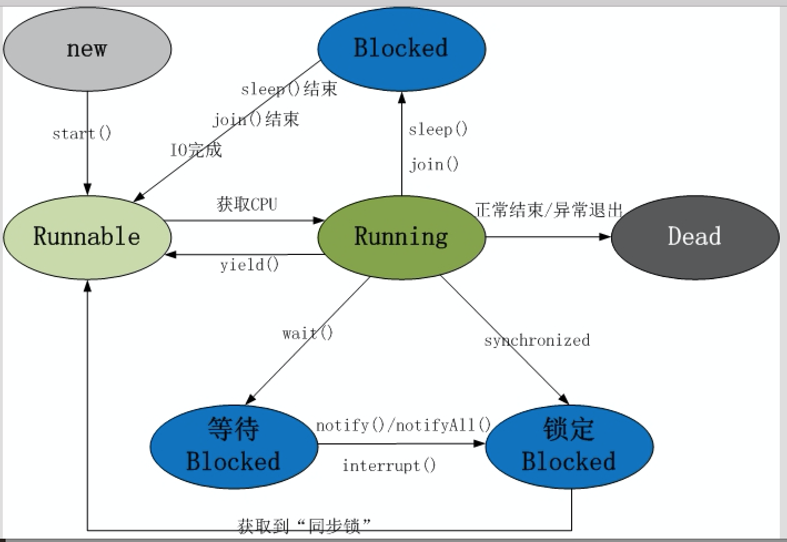

### 多线程基础

#### 回顾

```

```

#### 今天任务

```
1.进程和线程
	1.1 进程
	1.2 线程
	1.3 进程和线程的关系以及区别
2.多线程的实现
	2.1 继承Thread类
	2.2 实现Runnable接口
	2.3 两种实现方式的比较
	2.4 调用start()和run()方法的区别
3.线程的常用方法
	3.1 线程的名称
	3.2 线程休眠
	3.3 设置线程优先级
	3.4 合并线程
	3.5 后台线程
	3.6 线程让步
4.线程的生命周期
```

#### 教学目标

```
1.掌握进程和线程的概念以及二者之间的区别
2.掌握多线程的实现方式
3.了解线程常用方法的使用
4.掌握线程的生命周期
```

#### 第一节 进程和线程

##### 	1.1 进程

```
	正在运行的程序，是一个程序的运行状态和资源占用（内存，CPU）的描述，通过进程ID区分。
	进程是程序的一个动态过程,它指的是从代码加载到执行完毕的一个完成过程
	
	进程的特点：
		a.独立性：不同的进程之间是独立的，相互之间资源不共享（举例：两个正在上课的教室有各自的财产，相互之间不共享）
		b.动态性：进程在系统中不是静止不动的，而是在系统中一直活动的
		c.并发性：多个进程可以在单个处理器上同时进行，且互不影响
```

#####         1.2 线程

```
	线程就是一条执行路径。是进程的组成部分，一个进程可以有多个线程，每个线程去处理一个特定的子任务

	线程的执行是抢占式的，多个线程在同一个进程中可以并发执行，其实就是CPU快速的在不同的线程之间切换，也就是说，当前运行的线程在任何时候都有可能被挂起，以便另外一个线程可以运行
```

#####         1.3 进程和线程的关系以及区别

```
a.一个程序运行后至少有一个进程
b.一个进程可以包含多个线程，但是至少需要有一个线程，否则这个进程是没有意义的
c.进程间不能共享资源，但线程之间可以
d.系统创建进程需要为该进程重新分配系统资源，而创建线程则容易的多，因此使用线程实现多任务并发比多进程的效率高
```

#### 第二节 多线程的实现

#####      	2.1 继承Thread类   

```
继承自Thread类，Thread类是所有线程类的父类，实现了对线程的抽取和封装

继承Thread类创建并启动多线程的步骤：
		a.定义一个类，继承自Thread类，并重写该类的run方法，该run方法的方法体就代表了线程需要完成的任务，因此，run方法的方法体被称为线程执行体
		b.创建Thread子类的对象，即创建了子线程
		c.用线程对象的start方法来启动该线程
```

代码实现：

```java
public class ThreadUsageDemo01 {
	public static void main(String[] args) {
		
		//实际的子线程
		MyThread t0 = new MyThread();
		t0.setName("线程000");
		t0.start();
		
		MyThread t1 = new MyThread();
		t1.setName("线程111");
		t1.start();	
		
		/**
		 * static Thread currentThread() 
          	返回对当前正在执行的线程对象的引用。 
		 */
		//这个方法的调用在哪个线程的线程执行体中，则指的是哪个当前正在执行的线程
		Thread thread = Thread.currentThread();
		System.out.println(thread);//Thread[main,5,main]
		//Thread[Thread-0,5,main]
		//Thread[Thread-1,5,main]
		
		//Thread[线程的名字，线程的执行优先级，在哪个线程中创建的]
		
		System.out.println(thread.getName());//main
		
		//设置线程的名字
		thread.setName("主线程");
		
		System.out.println(thread.getName());
		
		//通过构造方法设置线程的名字
		MyThread1 t2 = new MyThread1("新的线程~~~~");
		t2.start();
	}
}
//线程类
class MyThread extends Thread {
	@Override
	public void run() {
		
		for(int i = 0;i < 10;i++) {
			System.out.println("hello" + i);
		}
		
		Thread thread = Thread.currentThread();
		System.out.println(thread);
		System.out.println(thread.getName());
	}
}

class MyThread1 extends Thread {
	public MyThread1() {}
	public MyThread1(String name) {
		super(name);//调用的父类中的Thread(String name)
	}
	@Override
	public void run() {
		Thread thread = Thread.currentThread();
		System.out.println(thread.getName());
	}
}
```

> ​	案例：模拟售票员售票

```java
public class ThreadTextDemo01 {
	public static void main(String[] args) {
		//需求：模拟4个售票员各售100张票
		SellTickets s1 = new SellTickets();
		SellTickets s2 = new SellTickets();
		SellTickets s3 = new SellTickets();
		SellTickets s4 = new SellTickets();
		
		s1.start();
		s2.start();
		s3.start();
		s4.start();
	}
}
class SellTickets extends Thread {
	//数据
    int ticket = 100;
	@Override
	public void run() {
		//循环售票
		while(true) {
          	 if(ticket<1){
                 break;
             }
			System.out.println(Thread.currentThread().getName() + "售出了第"+ticket+"张票");
			ticket--;
        }
	}
}
```

##### 	2.2 实现Runnable接口     

```
实现Runnable接口创建并启动多线程的步骤：

		a.定义一个Runnable接口的实现类，并重写该接口中的run方法，该run方法的方法体同样是该线程的线程执行体
		b.创建Runnable实现类的实例，并以此实例作为Thread的target来创建Thread对象，该Thread对象才是真正的线程对象
		c.调用线程对象的start方法来启动该线程    
```

> ​	案例：模拟售票员售票

```java
//票
public class TicketRes implements Runnable{
     	int ticket = 100;
		@Override
		public void run() {
			while(true) {
                 if(ticket<1){
                     break;
                 }
                System.out.println(Thread.currentThread().getName() + "售出了第"+ticket+"张票");
                ticket--;
       		 }
		}
}
public class ThreadTextDemo02 {
	public static void main(String[] args) {
      	// 票
         TicketRes res=new TicketRes();
      	//线程对象
		Thread t0 = new Thread(res);
		Thread t1 = new Thread(res);
		Thread t2 = new Thread(res);
		Thread t3 = new Thread(res);
		
		t0.start();
		t1.start();
		t2.start();
		t3.start();
	}
}
```

案例：你和你女朋友公用一张银行卡，你向银行卡中存取、你女朋友取钱！

```java
//银行卡类
/*
 * 银行卡
 */
public class BankCard{
	private int banlance;//余额

	public int getBanlance() {
		return banlance;
	}

	public void setBanlance(int banlance) {
		this.banlance = banlance;
	}
	
}
```

```java
/*
 * 存钱功能
 */
public class SaveMoney implements Runnable{
	private BankCard card;
	public SaveMoney(BankCard card) {
		this.card=card;
	}
	@Override
	public void run() {
		for(int i=0;i<10;i++){
			card.setBanlance(card.getBanlance()+10000);
			System.out.println(Thread.currentThread().getName()+"存了10000，余额是:"+card.getBanlance());
		}
		
	}
	
}
```

```java
/*
 * 取钱功能
 */
public class SubMoney implements Runnable{
	
	private BankCard card;
	public SubMoney(BankCard card) {
		this.card=card;
	}
	
	@Override
	public void run() {
		for (int i = 0; i < 10; i++) {
			if(card.getBanlance()>=10000){
				card.setBanlance(card.getBanlance()-10000);
				System.out.println(Thread.currentThread().getName()+"取了10000，余额是:"+card.getBanlance());
			}else{
				System.out.println("余额不足，该存钱了....");
				i--;
			}
			
		}
		
	}
}	

```

```java
public static void main(String[] args) {
		//1创建银行卡
		BankCard card=new BankCard();// 0
		//2存取功能
		SaveMoney save=new SaveMoney(card);
		//3取钱功能
		SubMoney sub=new SubMoney(card);
		//4线程对象
		Thread shaqiang=new Thread(save,"张莎强");
		Thread fengjie=new Thread(sub,"凤姐");
		//5启动
		shaqiang.start();
		fengjie.start();
		
	}
```


##### 	2.3 两种实现方式的比较 

```
实现Runnable接口的方式
	a.资源类实现了Runnable接口。如果资源类有多个操作，需要把功能提出来，单独实现Runnable接口,可以继承其他类。
	b.可以多个线程共享同一个资源，所以非常适合多个线程来处理同一份资源的情况
	c.弊端：编程稍微复杂，不直观，如果要访问当前线程，必须使用Thread.currentThread()

继承Thread类的方式
		a.编写简单，如果要访问当前线程，除了可以通过Thread.currentThread()方式之外，还可以使用getName()
		b.弊端：因为线程类已经继承了Thread类，则不能再继承其他类【单继承】

	实际上大多数的多线程应用都可以采用实现Runnable接口的方式来实现【推荐使用匿名内部类】 
```

##### 	2.4 调用start()与run()方法的区别

```
	当调用start()方法时将创建新的线程，并且执行run()方法里的代码，但是如果直接调用start()方法，不会创建新的线程也不会执行调用线程的代码    
```

##### 2.5 线程的第三种创建方式:

使用Callable接口实现多线程

```java
public class MyCallable implements Callable<Integer>{

	@Override
	public Integer call() throws Exception {
		int sum=0;
		for(int i=1;i<=100;i++){
			Thread.sleep(100);
			sum+=i;
		}
		System.out.println("子线程执行了........."+Thread.currentThread().getName());
		//System.out.println("子线程执行了........."+Thread.currentThread().getName());
		return sum;
	}

}
```


```java
	public static void main(String[] args) throws Exception{
		//1创建Mycallable对象(可调用的)
		MyCallable callable=new MyCallable();
		//2创建一个任务实现Runable接口
		FutureTask<Integer> task=new FutureTask<Integer>(callable);
		//3创建线程对象
		Thread thread=new Thread(task);
		//4启动
		thread.start();
		//5获取返回值
		Integer sum=task.get();//会等待子线程执行完毕，返回结果
		System.out.println(sum);
		
	}
```


#### 第三节 线程的常用方法	

##### 	3.1 设置线程的名称

```
	在前面ThreadUsageDemo01中有体现
```

##### 	3.2 线程休眠

```
	使得当前正在执行的线程休眠一段时间，释放时间片，导致线程进入阻塞状态
	sleep（5000），5000的单位是毫秒，设置了sleep就相当于将当前线程挂起5s,这个操作跟线程的优先级无关，当对应的时间到了之后，还会再继续执行
```

代码实现：

```java
public class ThreadFunctionDemo01 {
	static Runnable r = new Runnable() {
		
		@Override
		public void run() {
			while(true) {
				System.out.println(Thread.currentThread().getName() + "在执行");
			
				//设置线程休眠
				try {
					Thread.sleep(1000);
				} catch (InterruptedException e) {
					// TODO Auto-generated catch block
					e.printStackTrace();
				}
			}
		}
	};

	public static void main(String[] args) {
		Thread t0 = new Thread(r);
		t0.setName("线程000");
		t0.setPriority(8);
		t0.start();
		
		Thread t1 = new Thread(r);
		t1.setName("线程111");
		t1.setPriority(3);
		t1.start();
	}
}
```

##### 	3.3 设置线程优先级	

```
	可以通过设置优先级来改变线程抢到时间片的概率，优先级高的线程获得较多的执行机会
	默认情况下，每个线程的优先级都与创建它的父线程具有相同的优先级，例如：main线程具有普通优先级，则由main线程创建的子线程也有相同的普通优先级

	注意：
	所传的参数范围1~10，默认为5，对应的数值越大，说明优先级越高，这个方法的设置一定要在start之前
	线程的优先级低并不意味着争抢不到时间片，只是抢到时间片的概率比较低而已
```

```
在ThreadFunctionDemo01中
```

##### 	3.4 合并线程

```
	在执行原来线程的过程中，如果遇到了合并线程，则优先执行合并进来的线程，执行完合并进来的线程后，再回到原来的任务中，继续执行原来的线程

	特点：
		a.线程合并,当前线程一定会释放cpu时间片,cpu会将时间片分给要Join的线程
		b.哪个线程需要合并就在当前线程中,添加要合并的线程
		c.join之前,一定要将线程处于准备状态start
```

代码实现：

```java
public class JoinFunctionDemo01 {
	public static void main(String[] args) {
		//CustomThread thread = new CustomThread("新的线程");
		//thread.start();
		
		for(int i = 0;i < 100;i++) {
			System.out.println(Thread.currentThread().getName() + i);
			if(i == 20) {
				//合并线程
				CustomThread thread = new CustomThread("新的线程");
				thread.start();
				
				//将需要合并的线程join
				//优先执行合并进来的线程
				try {
					thread.join();
				} catch (InterruptedException e) {
					// TODO Auto-generated catch block
					e.printStackTrace();
				}
			}
		}
	}
}
class CustomThread  extends Thread {
	public CustomThread(){}
	public CustomThread(String name) {
		super(name);
	}
	
	@Override
	public void run() {
		for(int i = 0;i < 100;i++) {
			System.out.println(Thread.currentThread().getName() + i);
		}
	}
}
```

##### 	3.5 后台线程

```
	隐藏起来一直在默默运行的线程，直到进程结束，又被称为守护线程或精灵线程，JVM的垃圾回收线程就是典型的后台线程
	特征：如果所有的前台线程都死亡，后台线程会自动死亡，设置后台线程必须要在start之前执行
```

代码实现：

```java
public class DeamonFunctionDemo {
	public static void main(String[] args) {
		
		DaemonThread thread = new DaemonThread();
		//设置后台线程
		thread.setDaemon(true);
		thread.start();
		
		//主线程的任务
		for(int i = 0; i < 10;i++) {
			System.out.println(Thread.currentThread().getName() + i);
		}
	}
}

class DaemonThread extends Thread {
	@Override
	public void run() {
		for(int i = 0;i < 1000;i++) {
			System.out.println(Thread.currentThread().getName() + i);
		}
	}
}
```

##### 	3.6 线程让步

```
	可以让当前正在执行的线程暂停，但它不会阻塞该线程，他只是将该线程转入就绪状态，完全可能出现的情况是：当某个线程调用了yield方法暂停之后，线程调度器又将其调度出来重新执行

	实际上，当某个线程调用了yield方法暂停之后，只有优先级与当前线程相同，或者优先级比当前线程更高的就绪状态的线程才会获得执行的机会
```

代码实现：

```java
public class YieldFunctionDemo01 {
	public static void main(String[] args) {
		YieldThread t0 = new YieldThread("线程000");
		//t0.setPriority(8);
		t0.start();
		
		YieldThread t1 = new YieldThread("线程111");
		t1.start();
	}

}
class YieldThread extends Thread {
	public YieldThread(){}
	public YieldThread(String name) {
		super(name);
	}
	@Override
	public void run() {
		for(int i = 0;i < 50;i++) {
			System.out.println(Thread.currentThread().getName() + " " + i);
			
			if(i==20) {
				//线程让步，不会让线程进入阻塞状态
				Thread.yield();
			}
		}
	}
}
```

##### 3.7 线程中断 interrupt()

程序在等待过程中，可以使用interrupt方法打断。

```java
public class InterruptDemo extends Thread{
	@Override
	public void run() {
		System.out.println("子线程开始执行了.............");
		try {
			System.out.println("子线程开始休眠 30秒.......");
			Thread.sleep(30000);
			System.out.println("子线程正常苏醒了...");
		} catch (InterruptedException e) {
			System.out.println("子线程被打醒了.....");
		}
		
		System.out.println("子线程结束了.......");
		
	}
}
```

```java
public static void main(String[] args) throws Exception{
		System.out.println("主线程执行了.....");
		InterruptDemo interruptDemo=new InterruptDemo();
		interruptDemo.start();
		System.out.println("30秒内按任意键结束子线程");
		System.in.read();//程序会让用输入一个数据
		interruptDemo.interrupt();//打断线程
		System.out.println("主线程结束了.............");
		
	}
```


#### 第四节 线程的生命周期

```
	对于线程，当线程被创建并启动之后，它既不是一启动就进入了执行状态，也不是一直处于执行状态，在线程的生命周期中，他会经历各种不同的状态【在一个进程中，多个线程同时运行，是在争抢CPU时间片】
```

```
New(新生)：线程被实例化，但是还没有开始执行

Runnable（就绪）:没有抢到时间片
Running（运行）:抢到了时间片，CPU开始处理这个线程中的任务
Blocked(阻塞):	线程在执行过程中遇到特殊情况，使得其他线程就可以获得执行的机会，被阻塞的线程会等待合适的时机重新进入就绪状态
Dead(死亡):线程终止
	a.run方法执行完成，线程正常结束【正常的死亡】
	b.直接调用该线程的stop方法强制终止这个线程
```



#### 总结

```

```

#### 课前默写

```
注：异常直接在main函数声明部分throws Exception即可
1.使用转换流实现文件内容的拷贝
2.将一个自定义类的对象写入本地文件中，然后再读取出来
```

#### 作业

```
1.设计两个线程，一个线程负责求出1~１０以内所有的偶数；然后，另外一个线程负责打印1~１０以内所有的奇数。
  	测试时，分别设置线程的优先级，观察执行的顺序。

2.贵妇正在看电视连续剧《芈月传》，从第1~88集，看到第10集时，来了一个送快递的，贵妇收完快递后后，继续看电视。

3.多线程模拟龟兔赛跑：
	乌龟和兔子进行1000米赛跑，兔子前进5米，乌龟只能前进1米。
	但兔子每20米要休息500毫秒，而乌龟是每100米休息500毫秒。
	谁先到终点就结束程序，并显示获胜方

4.编写多线程应用程序，模拟多个人通过一个山洞的模拟。这个山洞每次只能通过一个人，每个人通过山洞的时间为5秒，随机生成10个人，同时准备过此山洞，显示一下每次通过山洞人的姓名
```

#### 面试题

```
1.简述进程和线程各自的特点以及二者之间的区别与联系
2.简述线程的生命周期
3.线程的创建方式以及之间的区别和联系
4.sleep()方法和yield()方法之间的区别
```


