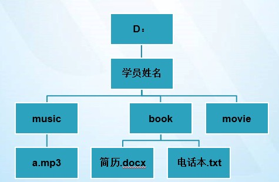
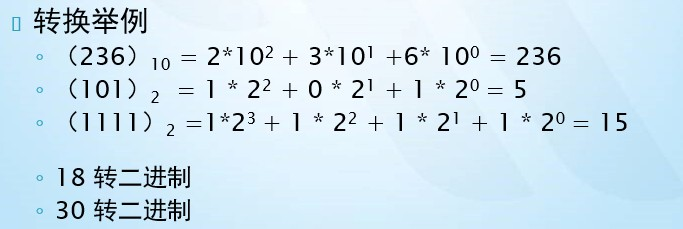
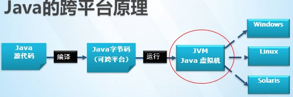
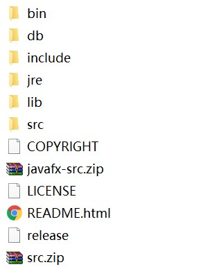
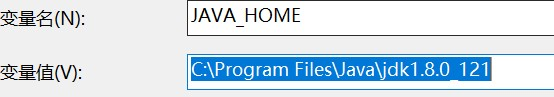
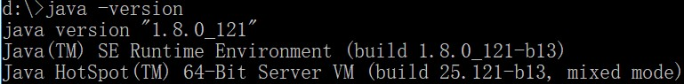

### Java第一天内容

#### 今天任务

```java
1.计算机组成
2.常用DOS命令
3.进制
4.Java发展简史
5.Java体系
6.Java机制
7.环境变量配置
8.注释
```

#### 教学目标

```java
1.计算机组成
2.掌握常用DOS命令
3.掌握进制
4.掌握Java发展简史
5.掌握Java体系
6.掌握Java机制
7.掌握环境变量配置
8.掌握注释
```

#### 第一节：计算机组成

计算机组成包括**硬件**和**软件**两大部分。

##### 1.1 硬件

​	硬件是指完成输入、存储、处理、输出功能的具体设备

​	

###### 	1.1.1 硬件主要包括：

- 输入设备：键盘、鼠标、摄像头、扫描仪
- 输出设备：显示器、打印机、音响
- CPU(Central Processing Unit)，中央处理单元：主要厂商有Intel、AMD
- 存储器：主要包括内存、硬盘、优盘
- 其他设备：主板、机箱等


###### 	1.1.2 CPU主要性能指标：

​		主频：CPU内核工作的时钟频率，也就是CPU工作频率

​		例如：Intel 酷睿 i5 2.4G、i7  2.6G 

###### 	1.1.3 存储单位:

​	 计算机存储器以位和字节计量

 	8bit      —— 1 byte 

​	1024 byte  —— 1 KB 

​	1024 KB    —— 1 MB 

​	1024 MB    —— 1 GB

​	1024GB    —— 1 TB

##### 1.2 软件

软件有两大类 ：系统软件和应用软件

系统软件：控制和支持计算机系统，例如：DOS、Windows7、Windows10、Mac、Linux

应用软件：通常指一些应用软件，例如：Office、PhotoShop、WinRAR等

#### 第二节：DOS命令

#####2.1 常用的DOS命令	

* cd 命令：改变当前目录

  ```
  cd [盘符:][路径名][子目录名]
  cd .. 返回上一级目录
  cd \或cd /  返回根目录，推荐使用cd \
  注意：如果需要访问非当前根目录下的目录文件，应该先输入该盘符，敲回车，然后再用cd命令
  如：
   d: 切换盘符d盘
   cd programs 进入programs目录
  ```

* dir命令：列出当前目录下的文件以及文件夹

  ```
  dir  [盘符:][目录路径] [/p]  [/s]  [/w]  [/o]  
  /p 分页显示下一页内容，按任意键查看下一屏
  /s 显示所有目录及其子目录下所有文件
  /w 宽屏显示
  /o 分类顺序显示
  ```

* md命令：创建目录

  ```
  md  [盘符:][路径名]<文件夹名>  
  md myFile 在当前目录下创建myFile文件夹
  md myPhoto\aaa\bbb 在当前目录下创建myPhoto\aaa\bbb多级目录
  注意：md命令还可以创建以.开头的文件夹。
  ```

* copy命令：复制一个或一组文件到指定磁盘或目录中

  ```
  copy  <源文件路径> [目标路径]   
  copy a.txt d:\myFile 复制a.txt文件到d:\myFile文件夹中
  copy myFile myPhoto  只赋值myFile文件夹下的所有文件到myPhoto中,不包括子文件夹中的文件
  如果要复制所有子文件夹下文件可使用:
  xcopy myFile myPhoto /s  不能复制空目录
  xcopy myFile myPhoto /e  复制空目录
  ```

* rd命令：删除目录

  ```
  rd  [盘符:][路径名]<子目录名>
  只能删除空目录，不能删除当前目录
  rd myFile 删除myFile目录
  rd myFile\aaa 只能删除aaa目录，不能删除myFile目录
  ```

* del命令：删除文件

  ```
  删除目录中的一个或一组文件,不能删除目录
  del info.txt 删除info.txt文件
  del myFile\* 删除myFile目录下所有的文件
  ```

* cls命令：清空屏幕

* exit命令：退出dos命令行

* mspaint：打开画图板

* notepad：打开记事本

**上机练习：**



```
参考代码
D:\>md 学员姓名
D:\>cd 学员姓名
D:\学员姓名>md music
D:\学员姓名>md book
D:\学员姓名>md movie
进入music目录 cd music
D:\学员姓名\music> type nul>a.mp3  (type nul>a.mp3 创建空文件)
进入book目录  
cd..
cd book
D:\学员姓名\book> echo 个人简历>简历.docx   (echo 内容> *.* 创建非空文件 )
D:\学员姓名\book> echo 13167371397>电话本.txt
```


#### 第三节：进制

##### 3.1 普及二进制

```java
计算机中的数据都以二进制数字保存。
二进制：逢二进一。即只有0、1两个值。
如：十进制的10在计算机内保存为二进制的1010
计算机中信息的存储单位
位（bit）：表示一个二进制数码0或1，是计算机存储处理信息的最基本的单位。
```

##### 3.2 进制转换

```java
1. 二进制转十进制
	要从右到左用二进制的每个数去乘以2的权次方相加
2. 十进制转二进制
	除2取余，逆序排列
```



进制转换练习：


#### 第四节:  JAVA发展简史

**计算机程序：**

为了让计算机执行某些操作或解决某个问题而编写的一系列有序指令的集合

编写程序的工具就是计算机语言，Java就是多种语言中的一种

**软件：**

软件是计算机程序、程序所用的数据以及有关文档资料的集合。


> ​	java之父：[詹姆斯·高斯林]
>
> ​	 Java是Sun（Stanford University Network）于1995年推出的一种高级编程语言
>
> ​	1998年 JDK1.2，更名为Java2
>
> ​	2000年 JDK1.3，JDK1.4
>
> ​	2004年 JDK1.5，更名为JDK 5.0
>
> ​	2005年 JDK6.0
>
> ​	2009年 Oracle（甲骨文）74亿美元收购Sun。取得java的版权。
>
> ​	2011年 java7.0 
>
> ​	2014年3月19日，java8.0

####第五节:  JAVA体系

#####5.1 JAVA的三个平台	

```
1. Java SE（Java Platform Standard Edition）。Java SE 以前称为 J2SE。它允许开发和部署在桌面、服务器、嵌入式环境和实时环境中使用的 Java 应用程序。
2. Java EE（Java Platform Enterprise Edition）。这个版本以前称为 J2EE。
	开发企业级的应用
3. Java ME（Java Platform Micro Edition）。这个版本以前称为 J2ME。Java ME 为在移动设备和嵌入式设备（比如手机、PDA、电视机顶盒和打印机）上运行的应用程序提供一个健壮且灵活的环境.
```
##### 5.2 JAVA 的应用场景

```
1.开发桌面应用程序
银行软件、商场结算软件
2.开发面向Internet的web应用程序
中国移动等门户网站、阿里巴巴等电子商务网站
3.提供各行业的解决方案 
金融、电信、电力 医疗 商务...
4.开发android手机应用程序
大数据开发的基础
```

#####5.3 JAVA的特性

```
1. 一种面向对象的编程语言
2. 一种与平台无关的语言。(它提供了在不同平台下的解释运行环境)
3. 一种健壮的语言，吸收了C/C++语言的优点。
4. 具有较高的安全性。(自动回收垃圾，强制类型检查，取消指针)
5. 开源
```


#### 第六节： Java运行核心机制

##### 6.1 计算机的高级编程语言类型：

* **编译型** C ,C++,Pascal
* **解释型** Basic

而Java 语言是两种类型的结合；**先编译,再解释执行**

##### 6.2 Java的两个核心机制

* Java虚拟机(Java Virtual Machine) JVM

  ```
  1 JVM可以理解成一个可运行Java字节码的虚拟计算机系统。 
  它有一个解释器组件，可以实现Java字节码和计算机操作系统之间的通信
  对于不同的运行平台，有不同 的JVM。
  2 JVM屏蔽了底层运行平台的差别，实现了“一次编译，随处运行”。
  ```

  所以Java语言是跨平台的。

  

* 垃圾回收器(Garbage Collection) 

  ```
  Garbage Collection垃圾回收：将不再使用的内存空间应当进行回收。
  1 在C/C++等语言中，由程序员负责回收无用内存,而Java语言消除了程序员回收无用内存空间的责任：
  2 JVM提供了一种系统线程跟踪存储空间的分配情况。并在JVM的空闲时，检查并释放那些可以被释放的存储空间。
  垃圾回收器在Java程序运行过程中自动启用，程序员无法精确控制和干预，即使程序员通过代码告诉垃圾回收器执行，也不会立即回收内存。
  ```

  ​

#### 第七节：环境搭建

##### 7.1 安装jdk

下载地址：http://www.oracle.com/technetwork/java/javase/downloads/jdk8-downloads-2133151.html

JDK(Java Development Kits)-- Java开发工具集

主要包括：

* JRE(Java RunTime Environment)Java运行时环境

* Java编译器(javac.exe)

* Java运行时解释器(java.exe)

* Java文档化工具(javadoc.exe)

* 其它工具及资源

  

[JDK安装步骤详情](JDK安装步骤详解.docx)

#####7.2 配置环境变量

1 添加JAVA_HOME环境变量，指向JDK安装目录



2 修改path：用于指定操作系统的可执行指令的路径，在路径最前面添加

​	%JAVA_HOME%\bin;

3.（可选）添加classpath：Java虚拟机在运行某个类时会按classpath指定的目录顺序去查找这个类

​	.;%JAVA_HOME%\lib\rt.jar;%JAVA_HOME%\lib\tools.jar

注：从JDK5.0以后默认就会到当前工作目录以及JDK的lib目录中查找

验证环境变量配置成功：打开命令行输入 java -version ,能看到如下图所示



#####7.3安装编译工具

```
第一周建议使用：记事本、EditPlus 或者是  notepad++
后面采用集成开发工具:Eclipse、MyEclipse、Idea
```

#####7.4 第一个HelloWorld

java开发需要三个步骤：


**第一步：编写源程序**

```java
// Demo类名
public class Demo {
	// 公开的公共  void 没有返回值   () 方法的标志
	public static void main(String[] args){		
	    // 静态的  main方法的名字      String[] args 方法参数
		System.out.println("Hello World!");
		// 系统 向外输出  打印
	}
}

//解释说明：
//1 public 关键字 公开的
//2 class 关键字 表示定义一个类
//3 Demo  类名  和文件名一致
//4 static 静态的,先记住意思，后面详细讲
//5 void 表示无返回值，先记住意思，后面讲
//6 main 主函数（方法），程序入口函数
//7 String[] 字符串数组类型
//8 args 方法参数
//9 System.out.println("Hello World!");输出Hello World
```

Java源程序(文件): 是一个后缀面是.java的文件，里面写的是java代码

**第二步：编译**

在命令行中输入：javac Demo.java

编译后会生成后缀名为class的文件,我们称为**字节码文件**

**第三步：运行**

在命令行中输入：java Demo

##### 7.5 源文件中的类

```
1. 如果类不是public修饰的 ， 类名可以和源文件的名字不同，但是如果 类名是public修饰的，那源文件的名字必须和类名相同。
2. 一个源文件中可以有多个类。
3. 一个源文件中至多只有一个用public修饰的类。
```

**上机练习：**

1 向控制台输出 “世界你好！！！”

2 向控制台输出 姓名，年龄，爱好


##### 7.6 输出方法 print、println、printf

* print()  输出内容没有换行
* println() 输出内容后有换行
* printf()   格式化输出，"%"表示进行格式化输出，"%"之后的内容为格式的定义（了解并查看帮助文档）
  * %f     "f"表示格式化输出浮点数。
  * %.2f  保留小数点后2位
  * %d    "d"表示输出十进制整数
  * %s    “s"表示输出字符串
  * %x   "x"表示输出16进制形式，X 表示大写


#### 第八节：注释

注释的作用就是帮助程序员理解程序的作用。

##### 8.1 单行注释 

```java
//适用于注释一行
```
##### 8.2 多行注释

```java
/*多行注释     
适用于同时注释很多行
注释内容
注释内容
*/
```

#### 总结

1 计算机组成：硬件和软件

2 dos命令

​	cd  改变当前目录

​	dir  列出当前目录中文件和文件夹

​	md  创建目录

​	rd    删除目录 

​        del   删除文件 

​        copy  复制

​        cls 清屏

​        exit 退出dos

​        mspaint

​        notepad 

   type   创建空文件 

   echo 创建非空文件

​    

3  java 历史 

  jdk8

4  java 运行核心机制 

​    1 jvm   java虚拟机 

​    2 垃圾回收器 

5 环境变量配置

   JAVA_HOME : 

  修改path

6 开发java程序

   第一步：编写源程序

   第二步：编译   class文件    javac  hello.java

   第三步：运行   java Hello


7 输出方法： print()  输出没有换行  ，println(); 输出有换行    ，printf() 格式化输出 （了解）

8 注释   //单行注释    

​            /*  

​		多行注释

​            */

#### 作业：

​	1.安装jdk配置好环境变量，默写hello world程序

​	2.打印古诗:
​	搞笑版:春晓
​	春眠不觉晓，处处蚊子咬。
​	夜来大狗熊，谁也跑不了。
​	原版: 《春晓》作者：孟浩然 春眠不觉晓，处处闻啼鸟。夜来风雨声，花落知多少。

​	搞笑版: 锄禾:  锄禾日当午，地雷埋下土。XX去挖土，炸成二百五。
  	原版: 锄禾日当午，汗滴禾下土，谁知盘中餐，粒粒皆辛苦。

​	搞笑版:  望庐山瀑布

​	日照香炉生紫烟，李白来到烤鸭店。

　　口水直流三千尺，一摸口袋没带钱。

​	原版: 日照香炉生紫烟, 遥看瀑布挂前川。 飞流直下三千尺, 疑是银河落九天。

#### 面试题

​	1.一个".java"源文件中是否可以包括多个类？有什么限制？

​	2.垃圾回收器的作用？垃圾回收器可以马上回收内存吗？

​	3 .此处，Something类的文件名叫OtherThing.java

​	class Something {

  		public static void main(String[]  args) {        

​       			System.out.println("Do something ...");

​    		}

​	}

​	 对吗？	