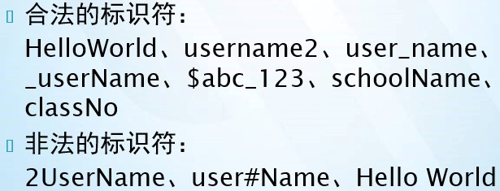
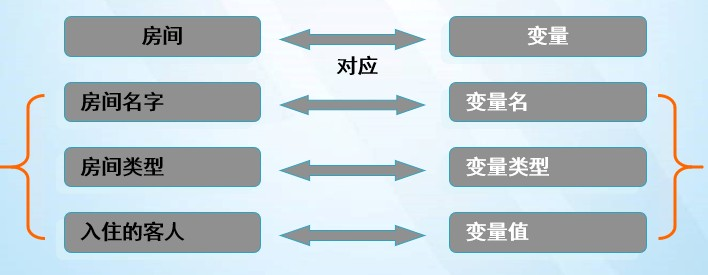
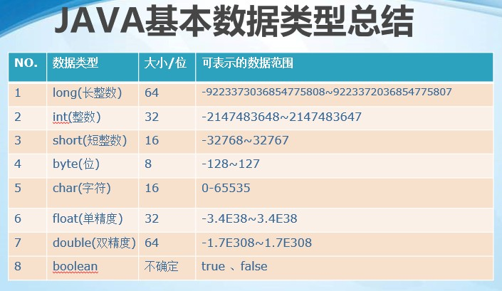

### Java基础语法

#### 回顾：

```
1 计算机组成 :硬件和软件
	硬件：输入设备、输出设备、cpu、存储器、其他设备
	软件：系统软件、应用软件
2 dos命令
	cd 改变当前目录  
		cd .. 上一级目录
		cd \  根目录
	dir 列出当前目录下的文件和文件夹
		/p  /s  /w  /o
	md 创建目录 
    	创建一级目录和多级目录
    rd 删除目录 (空目录)
    del 删除一个或一组文件
    copy 复制 只能复制文件 
    	xcopy  myFile myPhoto  /s  /e
	cls 清屏
    exit 退出dos
    mspaint 打开画图板
    notepad 打开记事本
 3 进制 
   十进制 
   	  逢10进1 ，有10个基本数字 
   二进制
      逢2进1 ，有2个基本数字 0 1 
   
   2 转 10  
     从右向左  每一个数字乘以2的权重 
     1101  =1*2（3）+1*2（2）+0*2（1）+1*2（0）=13
     
   10 转2 
     35 =  100011
     
   
 2 java发展
    java之父 ：詹姆斯 高斯林
    jdk 1.0  95
    jdk 1.2
    jdk 1.5  jdk5.0  
    jdk 6.0
    jdk 7.0
    jdk 8.0
    
3 java 三个平台 
   java SE  标准版   桌面应用程序
   java EE  企业版   开发Internet应用程序 ：淘宝，京东，移动
   java ME  微型版   (不用)

4 java 运行核心机制
   jvm  java虚拟机 java跨平台的语言
   垃圾回收器 
5 jdk安装 和环境变量的配置

6  第一个hello world  
   public  : 公共的
   class : 表示类
   Hello: 类名
   static  :静态的
   void :无返回值 
   main: 主函数(方法),程序的入口
   String[] :字符串数组 
   args: 参数
   system.out.println("hello world"); 输出 “hello World"
7  print :没有换行
   println：有换行
   printf：格式化输出  %f  %.2f  %d   %s  %x (X)
8 注释  ：
   // 单行注释 
   /*  .....
   ..... 多行注释
   .....
   */ 
   
```

#### 今天任务

```
1.标识符
2.标识符命名规范和命名习惯
3.关键字、保留字
4.常量、变量
5.基本数据类型
6.运算符
```

#### 教学目标

```
1.掌握什么是标识符
2.标识符的命名规范
3.掌握关键字和保留字
4.掌握变量
5.掌握八种基本数据类型
6.掌握运算符
```

####第一节：标识符、标识符命名规范、关键字、保留字

##### 1.1   什么是标识符	 

```
Java对包、类、方法、参数和变量等要素命名时使用的字符序列称为标识符。
```

##### 1.2 标识符的命名规则

```
1. 由字母（含英、中、日、俄等）、数字、下划线（_）和美元符号（$ 音：dollar）组成。
2. 不能以数字开头。
3. 区分大小写。
4. 长度无限制。（一般不要超过15个字符）
5. 不能是Java中的保留字和关键字。
```

##### 1.3 标识符命名习惯

```
1. 标识符命名习惯：见名知意。
2. 变量名，方法名，参数名: 首字母小写，如果多个单词组成，第一个单词首字母小写，剩下的单词首字母大写（驼峰式命名法）
3. 类名：单词首字母大写，多个单词组成每个单词首字母大写（帕斯卡命名法）    
```



##### 1.4 关键字、保留字	 	

```
关键字：Java中有一些赋予特定的含义，有专门用途的字符串称为关键字（keyword）。全部为小写
保留字：没有定义用途，但保留备用。goto、const
```

 		

#### 第二节：常量、变量

##### 2.1常量：常见的数值类型(也称为数据常量)，程序运行中固定不变的数据

> 整型常量（int）：123 、100、200、250、500 int 
>
> ```
>   Java语言整型的三种表示形式： 
>   十进制整数：如12, -314, 0,8,7。 
>   八进制整数：要求以0开头，如0127表示八进制的127 。
>   十六进制数：要求0x或0X开头，如0x1df3。
> ```
>
> 浮点数常量(小数) ：3.14 float ...
> 字符常量：’a’ char
> 布尔(逻辑)常量：true、false boolean
> 字符串String常量："a"、"abc"、"hello world",    ""
> null常量：表示的引用为空对象

##### 2.2 变量： 保存程序执行中的数据，可以变化的数据

```java
变量其实是内存中的一小块区域，使用变量名来访问这块区域。因此，每一个变量使用前必须要先申请(声明)，然后必须进行赋值(填充内容)，才能使用，变量中存储的数据就是常量。
```



##### 2.3 变量的声明和初始化

```
变量的声明格式：
 1. 先声明，再赋值(初始化)
 	数据类型  变量名； 
 	变量名 = 变量值；
 	举例：int i; 
 		 i=100;
 2. 声明同时赋值
 	数据类型  变量名 = 变量值；
 		int j=20;
```

##### 上机练习：

练习1：银行账户存储1000元，年利率是0.05，计算一年后账户余额？

​	      要求：使用变量保存数据

练习2：使用变量存储数据，实现个人简历信息的输出

​              姓名，年龄，工作年限，技术方向、兴趣爱好

​              要求：使用变量保存数据

##### 2.4 变量的分类

```java
1. 按所属的数据类型划分：
  基本类型变量：持有原始值。(原始数据类型)
  引用类型变量：持有引用值。(某个对象的引用，不是该对象本身)String 字符串
2. 按被声明的位置划分：
  局部变量：方法或语句块内部定义的变量
  成员变量：方法外部、类的内部定义的变量
```

##### 2.5 局部变量和成员变量的区别

```java
1. 声明的位置不同：
 局部变量的作用域就是它所在的方法或语句块
 成员变量的作用域是整个类体。
2. 是否拥有默认值：
 成员变量有默认值
 局部变量没有默认值	
```

#### 第三节：数据类型

Java数据类型可分为两大类:**基本数据类型**和**引用类型**

基本数据类型：byte、short、int、long、float、double、char、boolean

引用数据类型：类、接口、数组、枚举（后面讲解）


##### 3.1 基本数据类型：

> 整数型---- byte（字节）, short（短整型）, int（整型）, long（长整型）
>
> 浮点型---- float（单精度浮点型）, double（双精度浮点型）
>
> 字符型---- char
>
> 布尔型---- boolean


##### 3.2 基本数据类型的存储 

```java
Java中所有的基本数据类型都有固定的存储范围和所占内存空间的大小，而不受具体操作系统的影响，以保证Java程序的可移植性 
byte: 1个字节 ，范围 -128 到 127
short: 2个字节 ，范围 -32168到 32767
int：4个字节 
long :8个字节
float:4个字节
double:8个字节
char:2个字节
boolean：不确定
```

##### 3.3 整数型

```java
Java语言的整型数值默认为int型，如：int i = 3;
要声明long型可以加‘l’或‘ L’，如：long  l = 3L;
注意:在数值超过int的表述范围时(2147483647),需要加上l/L对long赋值
```
##### 3.4 浮点型

```java
float: 单精度浮点数（精度6,7位） 4个字节
double:双精度浮点数 (精度15,16位)  8个字节
Java浮点类型常量有两种表示形式
十进制数形式，必须含有小数点，例如:
3.14       314.0      0.314 
科学记数法形式，如
3.14e2      3.14E2      314E2 
Java浮点型常量默认为double型,如要声明一个常量为float型，则需在数字后面加f或F，如：
double  d = 3.14; float  f = 3.14f;

注意：float double存储的数据都是近似值。
```
##### 3.5 字符型

```java
char型数据用来表示通常意义上“字符”
char c = 'A';  char c2= '好';
Java字符采用Unicode编码，每个字符占两个字节，因而可用十六进制编码形式表示(Unicode是全球语言统一编码)
char  c1 = '\u0061';//相当于’a’
char c2=97;//ASCII美国标准信息交换码，相当于’a’
Java语言中还允许使用转义字符'\'来将其后的字符转变为其它的含义：
char c2 = '\n'; 
```


```java
//    \ 转义字符   可以将后面的n 转义成为 换行的操作
System.out.print("i的值= "+i+"\n");
System.out.print("y的值 = "+y);
System.out.print("f的值 = "+f);
System.out.println("c的值 = "+c);

// \t 水平制表符 
System.out.print("99\t98\t97\t96");
System.out.print("你好\"你好");
System.out.print("你好\\你好");
```
##### 3.6 布尔类型

```java
boolean类型适于逻辑运算，一般用于程序流程控制 
boolean类型数据只允许取值true或false，不可以用0或非0的整数替代true和false。

示例：
boolean  b = false;
boolean c = true;
```
##### 3.7 Java数据类型总结




##### 3.8 基本数据类型的转换

```java
基本数据类型之间的转换分为以下两种：
	*自动类型转换
	*强制类型转换
	*boolean 类型不能转换成任何其它基本数据类型。

2. 自动类型转换：数据类型取值范围小的转为取值范围大的
    * byte ---> short--->int--->long--->float --->double
    * char---> int
    * byte,short,char三者在计算时会转换成int类型  （了解）
    * int整型常量和字符常量在合理范围内可以直接赋值给 byte、short、int、char （了解）
    
    上机练习1：
        某班第一次Java考试平均分81.29，第二次比第一次多2分，计算第二次考试平均分。
		
	* 如果一个操作数为double型，则整个表达式可提升为double型。
	
	上机练习2：
    	byte b1=10;
		byte b2=20;
		byte b3=b1+b2; //有问题吗?

3. 强制类型转换：数据类型取值范围大的 转为 取值范围小的. 需要加强制转换符，也就是（要转换的数据类型）。
    long l = 100L;
	int i = (int)l;
    但有可能造成精度降低或数据溢出，使用时要小心。
    
    上机练习：
    去年Java所占市场份额是20，今年增长的市场份额是9.8，求今年所占份额？
    int beforeyear=20;
	int year=(int)(beforeyear+9.8);
    
```
​    

#### 第四节：运算符和表达式

##### 4.1 运算符的分类

```java
1.算术运算符：+ 、 - 、 * 、 / 、 % 、 ++ 、 --
2.赋值运算符：= 、 += 、 -= 、 *= 、 /= 、 %=
3.关系运算符：> 、 < 、 >= 、 <= 、 == 、 !=
4.逻辑运算符：! 、 & 、 | 、 ^ 、 && 、 ||
5.位运算符：& 、 | 、 ^ 、 ~ 、 >> 、 << 、 >>>(了解)
6.字符串连接运算符：+
7.三目运算符 ?:  
```

##### 4.2 算数运算符： 

| 描述   | 运算符  | 运算符  | 描述    |
| ---- | ---- | ---- | ----- |
| 加    | +    | %    | 求余、取模 |
| 减    | -    | ++   | 自增    |
| 乘    | *    | --   | 自减    |
| 除    | /    |      |       |

```java

上机练习1 : 有一个三位数，求十位上 的数字   
// 123    2 
int a = 123;
int b = a/10%10;
//		123/10 12%10   2 
int c = a%100/10;
```

```java
上机练习2： 		
int d = 5;
System.out.println((d++));// 自身加1 
System.out.println((d));// 自身加1 
		
int e = d++ + 6;
System.out.println(" =e "+ e);// 自身加1 

// --   放在前面是先自身减一  在参与运算
//     放后面   先参与运算   在自身减一
int f = d-- + 6;
System.out.println(" f =  "+ f);// 自身加1 

byte z = -128;
byte w = --z;// ++  在临界值不会报异常，赋的值是在取值范围内转圈 
System.out.println("w=  "+ w);// 自身加1 	
```
##### 4.3 赋值运算符：

| 运算符  | 描述              | 运算符  | 描述   |
| ---- | --------------- | ---- | ---- |
| =    | 赋值 比如:int i=10; | /=   | 除等于  |
| +=   | 加等于             | %=   | 模等于  |
| -=   | 减等于             |      |      |
| *=   | 乘等于             |      |      |

```java
int  i = 34;
//i = i + 45;
i+=45;	
i-=45;
        
// i = i -45;
i*=45;
i/=45;
i%=45;		
System.out.println("i= "+ i);
```
**上机练习**

•要求：键盘输入四位数字的会员卡号，使用“/”和“%”运算符分解获得会员卡各个位上的数字，将各个位上数字求和

##### 4.4 关系运算符：

| 运算符  | 描述   | 运算符  | 描述   |
| :--- | ---- | ---- | ---- |
| ==   | 相等于  | <=   | 小于等于 |
| !=   | 不等于  | >=   | 大于等于 |
| <    | 小于   |      |      |
| >    | 大于   |      |      |

```java
boolean b = 3>=3; // 关系运算符 最终的结果都是boolean类型的
boolean b2 = 3==2; // == 判断等号两边是否相等  如果相等就是true
boolean b3 = 3!=2; // != 判断等号两边是否不等   如果不等就是true

System.out.println(b3);	

```
##### 4.5 逻辑运算符：

逻辑运算符用于对boolean型数据进行运算，运算结果总是boolean型

| 运算符  | 描述   | 运算符  | 描述   |
| ---- | ---- | ---- | ---- |
| &    | 逻辑与  | &&   | 短路与  |
| \|   | 逻辑或  | \|\| | 短路或  |
| ^    | 异或   |      |      |
| ！    | 逻辑非  |      |      |


```java
// ==  判断基本数据类型的值 是否相同的   != 判断基本数据类型的值是否不等
// 引用数据类型  equals
int i=30;
boolean flag = i!=34;
System.out.println("flag = "+ flag);

boolean  flag2 = 	false&false;// & 必须是左右两边都是   true 结果才是true   
boolean  a =  false | false;// |  只要有一个true 结果就是true 两边都是false 结果才为false

System.out.println("flag2 = "+ flag2);
System.out.println("a = "+ a);

// &&  ||  有可能有一部分是执行不到的
	
// && 左边如果是 false 就不执行右边  最终结果是false
// || 左边是true 不用执行右边了   最终结果就是 true

int z = 5;
int w = 5;
boolean b = ++z>5 || ++w >5;// w 并没有被执行
System.out.println("b = "+ b+" z="+z+" w="+w);

// ! 逻辑非
boolean e = !true;
System.out.println("e = "+ e);

// ^ 异或    相同则为false  不同为true
boolean  f = true ^ false;
System.out.println("f = "+ f);

int  a = 4;
int c = 5;
boolean b4 = ++a>6 & ++c>3;
System.out.println(a);
System.out.println(c);
```
##### 4.6 位运算符(了解)

| 运算符  | 描述   | 运算符  | 描述    |
| ---- | ---- | ---- | ----- |
| &    | 按位与  | >>   | 右移    |
| \|   | 按位或  | <<   | 左移    |
| ^    | 按位异或 | >>>  | 无符号右移 |
| ~    | 按位取反 |      |       |


##### 4.7 字符串连接符 +

如果字符串和基本数据类型变量、常量连接以后，结果变成了字符串。

```java
System.out.println("Hello"+"World!");
System.out.println("Hello = "+ 5);// 字符串和基本数据类型变量 常量连接以后 都变成了 字符串
System.out.println("Hello = "+ 5+ 8);
System.out.println(5+"");
```

##### 4.8 三目运算符  ? :

X ? Y : Z

X为boolean类型表达式，先计算x的值，若为true，整个三目运算的结果为表达式y的值，否则整个运算结果为表达式z的值。

示例：

```java
//X ? Y : Z
// 1 X 必须是boolean类型表达式
// 2  Y Z 必须数据类型保持一致

int score = 99;
//boolean falg = score>80;
String str = score>80? "非常优秀" : "优秀";
char c = '男';
int i = c=='男'? 5 : (int)(4.0);
//  y 和  z  最好是保持数据类型一致
//  如果不一致  也必须保证 接收的  变量能够存储  y和  z的 数据类型
		
System.out.println(i);
// 需求: 大于90输出"非常优秀“，大于等于60”输出及格“，否则小于60输出”下个班见“
String str2 = score>90?"非常优秀":score>=60?"及格":"下个班见";
System.out.println(str2);
```
##### 4.8 表达式

```java
表达式：符合一定语法规则的运算符和操作数的序列 
      
            i % 10
            a = 0 
		   a==0      
            5.0 + a      
            (a - b) * c - 4      
            i < 30 && i % 10 != 0 
      
表达式的值和类型
* 对表达式中操作数进行运算得到的结果称为表达式的值 
* 表达式的值的数据类型即为表达式的类型 
```

#### 第五节：扩展Scanner的简单使用

需求：从控制台输入学员3门课程成绩(html，java，sql)，编写程序实现

​	（1）Java课和SQL课的分数之差

​	（2）3门课的平均分

```java
import java.util.Scanner;  //导入Scanner类
public class ScoreStat {
	 public static void main(String[] args) {
       	 //创建对象
		Scanner input = new Scanner(System.in);
		System.out.print("htmls的成绩是：");
		int html = input.nextInt();     //html分数
		int java = input.nextInt();
         int sql = input.nextInt();
		int diffen;       //分数差
		double avg;       //平均分
		 //省略输出成绩单代码……
		diffen = java - sql; //计算Java课和SQL课的成绩差
		System.out.println("Java和SQL的成绩差：" + diffen);
		avg = (html + java + sql) / 3;	//计算平均分
		System.out.println("3门课的平均分是: " + avg);
	 }
}
```

#### 总结

1  标识符: 给包、类、方法名、变量、参数定义的一个字符序列。

2  标识符命名规范: 

​	 1>只能包括字母、数字、下划线、$

​	 2> 不能以数字开头

​	 3>区分大小写

​	 4>长度无限制(不要超过15)

​         5>不能是java关键字

3 标识符命名习惯：

​	1>见名知意

 	2>方法名、变量名、参数名首字母小写，后面首字母大写, 驼峰式命名法

​         3>类名采用首字母大写，帕斯卡命名法

4 关键字和保留字

  public  

 class

 static 

void 等等

5 常量和变量

  常量：固定的数据。

​	整型常量:10,20

​	浮点常量:3.14

​	字符常量: 'a' 

​	布尔常量:true false

​	字符串常量: "xxxx","hello world"

​	null常量

  变量：本质就是内存中一块存储空间。

  变量名，变量的名字

  变量值，变量中存储的数据

 使用变量：

​	1》先声明，再赋值

​        int  num;

​        num=20;

​	2>声明的同时，赋值

变量分类 

​	1 按照类型 分： 基本数据类型变量和引用类型变量

​        2按照声明的位置分： 局部变量和成员变量

​    

6 数据类型 

两大类：基本数据类型和引用类型 

基本数据类型 : byte  short  int long float double char boolean 

引用类型 : 类 String 、数组 、接口、 枚举


  

byte : 1个字节    -128-127

short :2    -32768-32767

int :4 

long :8

float:4

double :8

char :2    0-65535

boolean :不确定

基本数据类型之间的转换  

1 自动类型转换 ： 表示�