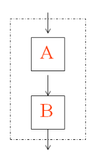
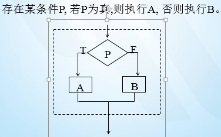
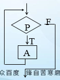
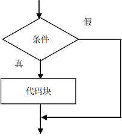
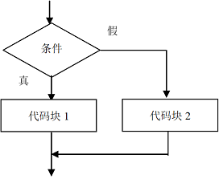

### 分支语句

#### 回顾：

```

```

#### 今天任务：

```
1.三种程序基本结构
2.if语句
3.switch语句
```

#### 教学目标：

```
1.什么是基本结构
2.分支语句
3.if语句
4.switch语句
```

#### 第一节：程序基本结构

>1. 顺序结构
>2. 选择结构
>3. 循环结构

##### 1.1 顺序结构

```java
程序从上到下一行一行的执行代码，没有判断和中转。
```



##### 1.2 选择结构

```java
有选择性的执行或者跳过指定代码
```

​	

##### 1.3 循环结构

​	重复执行一段代码，直到条件不成立




Java的选择结构使用选择语句来实现：

​	**1 if语句**

​	**2 switch语句**

#### 第二节：if语句

if语句有四种使用形式:

* if(条件){…}
* if(条件){…}else{…}
* if(条件){…}else if(条件){…}else{…}
* if(条件){ if(条件){...}  } else {...}

  ##### 2.1  简单if语句	

if ( 条件 ) { 

​        //代码块 

}



示例1：java成绩如果大于60，奖励一颗糖

```java
	//简单的if语句：
	//成绩如果大于60   给奖励
	int score = 10;
	if(score>60){
		System.out.println("给颗糖");
	}	
```

示例2：Java成绩大于98分，而且Html成绩大于80分，老师奖励他；或者Java成绩等于100分，Html成绩大于70分，老师也可以奖励他。

```java
if((score1 >98 && score2 > 80 ) || ( score1 == 100 && score2 > 70 )){
    //奖励
}
```


##### 2.2  if-else语句

if ( 条件 ) { 

​        //代码块1  

 }else{ 

​       //代码块2 

}





示例1:如果是男生就永远18岁，否则永远16岁。

```java
		// 如果是男生   就永远18岁
		// 如果是 女生  永远16岁		
		char c = '女';
		if(c == '男'){// boolean 结果是true  执行if中   否则执行else中的
			System.out.println("永远18岁");
		}else{
			System.out.println("永远16岁");
		}
```

上机练习1：买彩票

如果体彩中了500万，我买车、买房、非洲旅游

如果没中，继续买。

```java
public static void main(String[] args){
		//1创建input对象
		Scanner input=new Scanner(System.in);
		//2提示
		System.out.println("中500万吗?Y/N");
		String answer=input.next();
		//3判断
		if(answer.equals("y")){  //字符串的判断使用equals方法 
			System.out.println("买房、买车、欧洲旅游...");	
		}else{
			System.out.println("继续买....");
		}  	
	}
```


**注意：字符串的判断使用equals方法**

上机练习2：输入四位数字的会员号的百位数字等于产生的随机数字即为幸运会员，提示恭喜您中奖了，否则没中奖。

提示: int random=(int)(Math.random()*10); //随机数

注意：**Math.random();产生0-1之间的一个数字，含0不含1**  

```java
public static void main(String[] args){
		//创建Input对象
		Scanner input=new Scanner(System.in);
		//提示
		System.out.println("请输入四位的会员号:");
		int member=input.nextInt();

		//百位
		int bai=member/100%10;
		int ran=(int)(Math.random()*10);   //Math.random();产生0-1之间的一个数字，含0不含1 
		if(bai==ran){
			System.out.println("中奖了....旅游去吧");
		}else{
			System.out.println("好好干活...");
		}
	}
```


##### 2.3  多重if语句

 if ( 条件1) { 

​     //代码块1  

 }

 else if (条件2) { 

​     //代码块2 

 }

...

 else { 

​     //代码块3 

 }

示例1：如果成绩大于90并且是男生就送个女朋友，成绩大于90并且是女生送个男朋友，否则...

```java
	char c = '女';
	int score = 10;	
	if(score>90 && c=='男'){
			System.out.println("给送个女朋友");	
	}else if(score>90 && c=='女'){
			System.out.println("给送个男朋友");
	}else{
			System.out.println("啥都没有，自己买");
	}
```

上机练习 1：

我想买车，买什么车决定于我在银行有多少存款

如果我的存款超过500万，我就买保时捷

否则，如果我的存款超过100万，我就买宝马

否则， 如果我的存款超过50万，我就买帕萨特

否则， 如果我的存款超过10万，我就买qq

否则， 如果我的存款10万以下 ，我买捷安特

##### 2.4  嵌套if语句

if（条件1) {

​      if（条件2) {

​              代码块1

​      } else {

​              代码块2

​      }

} else {

​      代码块3

}

示例：如果成绩大于90   如果是男生 送个女朋友，   如果是女生送个男朋友

```java
	// 如果成绩大于90   如果是男生    如果是女生
		int score = 10;
		if(score>90){
			if(c=='男'){
				System.out.println("给送个女朋友");
			}else{
				System.out.println("给送个男朋友");
			}
		}
```

##### 2.5  特殊的if语句（不推荐使用）

```java
		//  特殊形式
		// 必须要求   if 或者 esle 语句中只能有一条语句
			if(score>60)
				System.out.println("好学生");
			else
				System.out.println("给送个女朋友");	
```


上机练习1：输入四个季节：如果春天，输出“春暖花开”，如果是夏天，输出“夏日炎炎”,如果是秋天，则输出"秋高气爽",如果是冬天，则输出"安静祥和"。

```java
// 1
import java.util.Scanner;

class  Demo8
{
	public static void main(String[] args) 
	{

		//  == 判断基本数据类型内容是否相等
		// 引用数据类型  ==  判断内存地址 
		// 判断内容  String 类型 判断内容 equals

		Scanner sc = new Scanner(System.in);
		String str = sc.next();
		
	//	boolean falg= str.equals("春天");
      if(str.equals("春天")){
   			System.out.println("春暖花开");
   		}else if(str.equals("夏天") ){
   			System.out.println("夏日炎炎");
   		}else if(str.equals("秋天")){
   			System.out.println("秋高气爽");
   		}else if(str.equals("冬天")){
   			System.out.println("安静祥和");	
   		}
   	}
   }
```
#### 第三节：  switch语句

##### 3.1 swtich语法规则

> 1. 表达式expr的值必须是下述几种类型之一：
>
> ​        byte、short、int、char、enum；java7之后可以是String。
>
> 2.  case子句中的值const 必须是常量值(或final的变量)，case中的值不能是一个范围
> 3.  所有case子句中的值应是不同的,否则会编译出错；
> 4.  default子句是可选的（不是必须的）
> 5.  break语句用来在执行完一个case分支后使程序跳出switch语句块；否则会继续执行下去

##### 3.2语法格式

```java
   switch(表达式expr){
   		case const1:
   			statement1;
   			break;
   		case const2:
   			statement2;
   			break;
   			… …
   		case constN:
  			statementN;
   			break;
   		default:
   			statement_dafault;
   			break;]
   	} 
```
##### 3.3 执行顺序：

```java
 所有的 case 都不满足需求的时候  执行default中的内容
 break 帮助跳出switch 语句的, 如果执行过程中 没有遇到  break 继续向下执行直到遇到break为止
```
##### 3.4 练习：

练习一： 简单实现switch语句

```java
	   int i = 1;
	   switch(i){
   			case 1:
   				System.out.println("Hello World!");
   				break;
   			case 2:
   				System.out.println("Hello World!2");
   			case 3:
   				System.out.println("Hello World3");
   				break;
   			default:
   				System.out.println("Haaaa");
   				break;
   		}
```
 练习二： 判断 春夏秋冬		
   ```java
Scanner sc = new Scanner(System.in);
   		String str = sc.next();
   		switch(str){
   			case "春天":
   				System.out.println("春暖花开");
   				break;
   			case "夏天":
   				System.out.println("闷热");
   				break;
   			case "秋天":
   				System.out.println("秋高气爽");
   				break;
   			case "冬天":
   				System.out.println("滴水成冰");
   				break;
   			default:
   				System.out.println("火星的");
   				break;
   		}
   ```
 练习三： 需求： 利用switch实现一个计算器操作		

```java
Scanner  sc = new Scanner(System.in);
   	System.out.println("请输入第一个操作数:");
   		int a = sc.nextInt();
   		System.out.println("请输入运算符");
   		String str = sc.next();
   		int b = 0;

   		// 利用了一个    if语句 帮助控制 如果是 ++ 或者是 -- 就不输入第二个操作数

   		if(str.equals("++")|| str.equals("--")){
   		}else{
   			System.out.println("请输入第二个操作:");
   			b = sc.nextInt();
   		}
   		switch(str){
   			case "+":
   				System.out.println(a+"+"+b+"="+(a+b));
   				break;
   			case "-":
   				System.out.println(a+"-"+b+"="+(a-b));
   				break;
   			case "*":
   				System.out.println(a+""+b+"="+(ab));
   				break;
   			case "/":
   				System.out.println(a+"/"+b+"="+(a/b));
   				break;
   			case "%":
   				System.out.println(a+"%"+b+"="+(a%b));
   				break;
   			case "++":
   				System.out.println("++"+a+"= "+(++a));
   				break;
   			case "--":
   			     System.out.println("--"+a+"= "+(--a));
   				break;
   			}
```

##### 3.5 特殊用法 ：case穿透

> case穿透： 产生这种现象的原因:由于某个case语句中缺少或者漏写break语句所导致的结果.

```java
// 需求:  打印输出指定的月份的天数

   		Scanner sc = new Scanner(System.in);

   		int month = sc.nextInt();

   		switch(month){

   			case 1:			

   			case 3:				

   			case 5:				

   			case 7:				

   			case 8:				

   			case 10:				

   			case 12:

   				System.out.println("31天");

   				break;

   			case 2:

   				System.out.println("28天");

   				break;

   			case 4:				

   			case 6:				

   			case 9:				

   			case 11:

   				System.out.println("30天");

   				break;		

   		}

   		System.out.println("Hello World!");

   	}
```

#### 第四节：总结

#### 默写

```
一、变量的分类——按照数据类型来分：
1.基本数据类型(8种):
1）数值型:
		*整型:byte(-128~127) short int long
		*浮点型: float double
2）字符型:char char类型占的是一个字符=两个字节=十六位
3）布尔型:boolean 注意,布尔类型的变量只有两种值:true false
2.引用数据类型：类、接口、数组、枚举
注意：除了基本数据类型以外的数据类型都是引用数据类型.

二、数据类型转换：
发生的场景：不同类型的变量之间进行运算
数据类型的转换分为两种：
1）自动类型转换:byte short char ==>int==>long==>float==>double
	注意：a.当byte short char 之间进行运算时结果属于int型；
		b.boolean类型不可以转换为其它的数据类型。  	
2）强制类型转换：将容量大的数据类型强制转换成容量小的数据类型，必须使用"(目标数据类型)"符号；
	格式是：小的数据类型 = (小的数据类型)大的数据类型。
	注意：强转后会造成精度的损失(丢失),丢的是高位。
三、算术运算符：+ - * / % ++ --
  1.取模：% 取余数，结果的符号取决于被模数的符号。
  2.++：让变量的值自增1
     1）前++：++在变量的前面，先自增1，后运算
     2）后++：++在变量的后面，先运算，再自增1
  3.--：让变量的值自减1
     1）前--：--在变量的前面，先自减1，再运算
     2）后--：--在变量的后面，先运算，再自减1
四、赋值运算符： = += -= *= /= %=
五、比较运算符：== < > <= >= !=
六、逻辑运算符： & && | || ! ^ （运算符两端是条件表达式）
  1.逻辑与和短路与的区别: &  &&
     1）逻辑与：& 无论左端是否为false，右端都会执行。
     2）短路与：&& 只要左端是false，则右端不执行，结果都为false。
  2.逻辑或和短路或的区别：|  ||
     1）逻辑或：| 无论左端是否为true，右端都会执行。
     2）短路或：|| 只要左端是true，则右端不执行，结果都为true。
     注意：在日常开发中，我们建议使用短语与、短路或。
```

####  作业

```
1.编程实现已知某人的工资(要求输入)，求他应该缴纳的个人所得税以及最后得到的工资。
	个人所得税计算方法计算方法 :
	全月应纳税所得额 =工资薪金所得-3500 
	应纳税额 = 应纳税所得额 *税率-速算扣除数 
	级数	全月应纳税所得额 			税率（％）	 速算扣除数 
	1		不超过500元的					5 		 	0 
	2		超过500元至2000元的部分 		10 		 	25 
	3		超过2000元至5000元的部分 	15 		 	125 
	4		超过5000元至20000元的部分 	20 		 	375 
	5		超过20000元至40000元的部分 	25 		 	1375 
	6		超过40000元至60000元的部分 	30 		 	3375 
	7		超过60000元至80000元的部分 	35 		 	6375 
	8		超过80000元至100000元的部分	40 		 	10375 
	9		超过100000元的部分	       		45		 	15375 

2.编写程序，给定一个学生成绩，给出相应等级：
90~100 优秀
80~89 良好
70~79 中等
60~69 及格
0~59 不及格
使用两种作法

3.从键盘接收一个名次(int)  使用switch-case作如下分支
  名次为1   奖IPHONE8
  名次为2   奖IPHONE7
  名次为3   奖IPHONE6
  名次为 4   奖IPHONE5
  其它名次   努力吧，少年
4. 编写程序，判断给定的某个年份是否是闰年。
闰年的判断规则如下：
      （1）若某个年份能被4整除但不能被100整除，则是闰年。
      （2）若某个年份能被400整除，则也是闰年。
5定义三个整型变量x,y,z，从键盘初始化变量值，判断三个变量的大小，将较大的值赋给变量max，将max输出,注意输入使用scanner输入。
```


#### 面试题

```
1.switch是否能作用在byte上，是否能作用在long上，是否能作用在String上?
2.switch中default的位置是否必须出现在最后？
```


