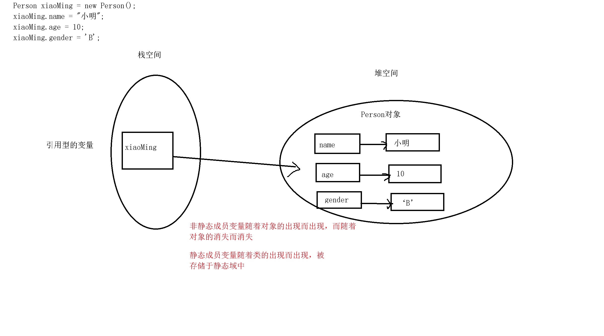

### 面向对象

#### 回顾

```

```

#### 今天任务

```
1. 面向对象
2. 面向过程
3. 类的创建
4. 对象的创建
5. 对象创建内存分析
6. 构造方法
7. this关键字
```

####教学目标

```
1. 掌握面向对象思想
2. 掌握类和对象的创建
3. 掌握对象创建内存分析
4. 掌握构造方法
5. 掌握this关键字
```

#### 第一节 ： 面向对象的设计思想

##### 	1.1 什么是面向对象     

```java
一种看待问题的思维方式，着眼于找到一个具有特殊功能的具体个体，然后委托这个个体去做某件事情，我们把这个个体就叫做对象
是一种更符合人类思考习惯的思想【懒人思想】，可以将复杂的事情简单化，将程序员从执行者转换成了指挥者
使用面向对象进行开发，先要去找具有所需功能的对象来用，如果该对象不存在，那么创建一个具有所需功能的对象
```

##### 1.2 面向过程

```
一种看待问题的思维方式，在思考问题的时候，着眼于问题是怎样一步一步解决的，然后亲力亲为的去解决问题
```

##### 1.3 面向对象和面向过程的对比

> ##### 	面向对象是基于万物皆对象这个哲学观点
>
> ​	举例说明：
>
> ​	案例一：我想要吃大盘鸡
> ​	面向过程 							面向对象
> ​	1.自己去买菜						1.委托一个会砍价的人帮忙去买菜
> ​	2.自己择菜						2.委托一个临时工帮忙择菜
> ​	3.自己做菜						3.委托一个厨师帮忙做菜
> ​	4.自己开始吃						4.自己开始吃
>
> ​	案例二：小明是一个电脑小白，想要配一台电脑，买完零件后需要运到家里，组装完成后打开电脑玩游戏
> ​	面向过程 							面向对象
> ​	1.小明补充电脑知识		1.委托一个懂电脑的朋友(老王)去帮忙买零件
> ​	2.小明去买零件				2.委托一个能跑腿的人去买零件
> ​	3.小明把零件带回家里	2.委托一个快递小哥帮小明送到家里
> ​	4.小明组装电脑				3.委托一个会组装电脑的人帮小明组装电脑
> ​	5.小明开机玩电脑			4.小明自己打开电脑，开始玩游戏

##### 	1.4  区别总结    

```java
a.都是看待问题的一种思维方式，都能解决问题
b.面向过程着眼于所有的事情按照步骤来实现
c.面向对象着眼于找到一个具有特殊功能的对象，委托这个对象去做某件事情
注意：面向对象时一种思想，并不是一门编程语言
```

##### 	1.5 类的定义

```java
一个具有特殊功能的实体的集合[群体]，类是Java语言的最基本单位
```

##### 	1.6 对象的定义

```java
在一个类中，一个具有特殊功能的实体，能够解决特定的问题，对象也被称为实例
```

##### 	1.7 类与对象之间的关系

```java
a.类是对象的抽象（模板）,对象是类的具体体现(实例)
b.Java中描述事物通过类的形式体现,类是具体事物的抽象,对象即是该类事物实实在在的个体
```

##### 	1.8 类的声明

> ​	语法：访问权限修饰符 class 类名 {
>
> ​						//类体
> ​		    }
>
> ​	说明：a.访问权限修饰符：只能是public(可以被省略，省略后为default)
> ​		    b.类名只要是一个合法的标识符即可，但是要求：首字母必须大写，遵循帕斯卡命名法
> ​		    c.尽量使用单个或多个有意义的单词连接而成
> ​			
> ​		     public class FirstDemo {
>
> ​		     }
>
> ​	注意：a.一个Java文件中可以写多个类，如果写多个类，则编译后会生成多个.class文件
> ​	            b.一个Java文件中最多只能有一个被public修饰的类，这个类的类名必须和Java源文件名保持一致
> ​		    c.一个Java文件中如果只有一个类，并且这个类不用public修饰的话，类名和文件名可以不一样，但习惯上，我们都会写上public

##### 	1.9  类中成员变量的定义

> ​	成员变量：
>
> ​		a.成员变量其实就是全局变量
> ​		b.成员变量也被称为属性
> ​		c.分为静态变量和非静态变量
> ​		d.在静态方法中只能访问静态成员变量，在非静态方法中可以访问非静态成员变量和静态成员变量
>
> ​	成员变量【全局变量】和局部变量的区别：
> ​	a.定义的位置不同
>
>    			成员变量：定义于类中，作用于整个类
>    			局部变量：定义于方法或者语句中，作用于该方法或者该语句。
>
> ​	b.内存中出现的时间和位置不同
>
>    			成员变量：当对象被创建时，出现在堆内存当中。
>    			局部变量：所属的区间被运算时，出现在栈内存当中。
>
> ​	c.生命周期不同
>
>    			成员变量：随着对象的出现而出现，随着对象的消失而消失。
>    			局部变量：随着所属区间运算结束，它就被释放。
>
> ​	d.初始化值不同
>
>    			成员变量：成员变量因为在堆内存当中，所以他有默认的初始值
>    			局部变量：没有默认的初始值
>
> ​	e. 成员变量和局部变量名字相同，局部变量优先级高。就近原则。

##### 	1.10 类中方法的定义

> ​	a.分为静态方法和非静态方法
>
> ​	b.在同一个类中，在静态方法中只能调用静态方法，在非静态方法中可以调用非静态方法和静态方法

```java
class TextDemo01
{
	//定义非静态全局变量
	String str;

	//定义静态全局变量
	static int num;

	//main是静态函数
	public static void main(String[] args) 
	{
		show();
		//结论一：在同一个类中，在静态函数中不能调用非静态函数
		// 错误: 无法从静态上下文中引用非静态 方法 display()
		//display();

		//结论三：在同一个类中，在静态函数中只能访问静态全局变量
		// 错误: 无法从静态上下文中引用非静态 变量 str
		//System.out.println(str);
		System.out.println(num);//0

		//定义一个局部变量
		//当全局变量和局部变量重名的时候，访问的时候采用就近原则
		//尽量避免全局变量和局部变量重名
		int num = 10;
		System.out.println(num);
	}

	//静态函数
	public static void show() {
		System.out.println("show");
	}

	//非静态函数
	public void display() {
		System.out.println("display");
		//结论二：在同一个类中，非静态函数可以调用静态函数，也可以调用非静态函数
		show();
		display11();

		//结论四：在同一个类中，非静态函数可以访问静态全局变量以及非静态全局变量
		System.out.println(str);
		System.out.println(num);
	}

	//非静态函数
	public void display11() {
		System.out.println("display11");
	}
}
```

总结：1 静态能访问静态的，不能直接访问非静态的，如果要访问，必须要创建对象。

​            2非静态的能直接访问非静态的和静态的。

​	    3 如果要访问另外一个类中的静态成员变量和静态方法 类名.静态成员变量  类名.静态方法名

​	   

#### 第二节：对象的创建以及内存分析

##### 	2.1 对象的创建

> ​	对象的创建过程也被称为对象的实例化过程
>
> ​	语法：类名 标识符 = new 类名();

```java
//演示对象的创建，跨类进行调用成员方法以及访问成员变量
//测试类：含有main函数得类被称为测试类
public class TextDemo01 
{
	public static void main(String[] args) 
	{
		//1.创建对象
		//语法:类名 变量名称  = new  类名();
		Person xiaoMing = new Person();

		//2.调用其他类中的非静态方法和访问其他类中非静态成员变量
		//语法：对象.
		System.out.println(xiaoMing.name);
		//虽然是跨类进行访问，Person类中成员变量仍然是一个变量，值可以随时发生改变
		xiaoMing.name = "小明";
		System.out.println(xiaoMing.name);
		xiaoMing.age = 10;
		xiaoMing.gender = 'B';

		xiaoMing.eat();

		//3.调用其他类中的静态方法和访问其他类中静态成员变量
		//语法：对象.    类名.
		System.out.println(Person.country);
		Person.country = "中国";
		System.out.println(Person.country);

		Person.run();

		xiaoMing.country = "China";
		System.out.println(Person.country);
		System.out.println(xiaoMing.country);

		xiaoMing.run();

		//4.同一个类可以创建多个对象
		Person xiaoLi = new Person();
	}
}

//实体类：表示具有某些特征或者某些行为的类
//描述多个对象所具有的共同特征和共同行为
//需求：人类，具有姓名，年龄，性别等的特征，可以吃东西，可以奔跑，，，，
class Person
{
	//第一部分
	//成员变量：特征【名词】
	//非静态成员变量
	String name;//null
	int age;//0
	char gender;//\u0000

	//静态成员变量
	static String country;//null

	//第二部分
	//成员方法：行为【动词】
	//非静态成员方法
	public void eat() {
		System.out.println("eating~~~~");
	}

	//静态成员方法
	public static void run() {
		System.out.println("running~~~~");
	}
}
```

##### 2.2  内存分配

程序运行时，操作系统会分配三块主要的内存空间

* **栈**：直接存放基本类型的局部变量，和引用类型的地址
  * 栈空间比较小，存取速度相对较快
  * 先进后出
* **堆**：存放引用类型的实际数据部分
  * 堆空间比较大，存取速度相对较慢
* **方法区**：（静态区、串池、代码段）方法区中有一块空间叫串池，用来存放字符串常量

##### 	2.3  内存分析

> 

> ​	说明：程序中定义的Person类型的变量实际上是一个引用，它被存放在栈内存中，他指向实际的Person对象，而真正的Person对象则存放于堆内存中

##### 2.4 练习

```java
//测试类
class PracticeDemo01 
{
	public static void main(String[] args) 
	{
		//需求：开学了，王老师让学生小明，小花，小丽做自我介绍
		//姓名，年龄，爱好，来一段才艺展示
		/*
		老师类
		特征：姓名
		行为：让学生做自我介绍
		*/
		//1.创建一个老师的对象
		Teacher wang  = new Teacher();
		wang.name = "王老师";
		wang.letStuIntroduce();
	}
}

//实体类
//老师类
class Teacher
{
	String name;

	//参数：学生，Student类型
	public void letStuIntroduce() {
		
		Student stu=new Student();
     	 stu.name = "小明";
		stu.age = 10;
		stu.hobby = "吹牛逼";
		stu.introduce();
		stu.dance();
      	 stu.sing();
         stu.lie();
	}
}

//学生类
class Student
{
	String name;
	int age;
	String hobby;

	public void introduce() {
		System.out.println("我是" + name + "今年" +  age + "爱好：" + hobby);
	}

	public void dance() {
		System.out.println("跳一段广场舞");
	}

	public void sing() {
		System.out.println("来一段freeStyle");
	}

	public void lie() {
		System.out.println("吹个牛逼");
	}
}
```

#### 第三节：构造方法的定义

##### 	3.1  构造方法的定义

> ​	构造方法也叫构造器，是指当实例化一个对象（创建一个对象）的时候，第一个被调用的方法
>
> ​	语法：访问权限修饰符 类名() {
> ​						//方法体
> ​				  }
>
> ​	普通方法：
> ​	访问权限修饰符 其他的修饰符 返回值类型 方法名（参数列表） {
>
> ​	}
>
> ​	说明：a.构造方法是在实例化对象的过程中自动调用的
>
> ​	            b.如果不写构造方法，系统会默认为我们提供一个无参的构造方法
> ​		    c.构造方法没有返回值类型
> ​		   d.如果添加了构造方法，系统不再提供默认的构造方法

##### 	3.2  构造方法的调用

```java
//演示构造方法的使用
class TextDemo05 
{
	public static void main(String[] args) 
	{
		//1.系统会默认提供一个无参的构造方法
		Animal a = new Animal();
		aa.show();
		aa.show();
		aa.show();
	}
}

class Animal
{
	//无参的构造方法
	//构造方法是在实例化对象的过程中被自动调用的，不需要手动调用
	
	public Animal(){
		System.out.println("无参的构造方法被调用");
	}
	


	public void show() {
	}
}
```

##### 3.3 构造方法和普通方法的区别 

> ​	a.构造方法是在创建对象的过程中自动调用的，普通方法只能手动进行调用
> ​	b.构造方法没有返回值类型【注意区别返回值void】，普通方法的返回值类型要么是确定的类型，要么为void
> ​	c.系统会默认为我们提供一个无参的构造方法,普通方法只能手动添加
> ​	d.构造方法的方法名称必须和对应的类名保持一致
> ​	e.构造方法在创建对象的过程中就会执行，而且每个对象只执行一次，对于普通方法而言，只有在需要使用的时候才被执行，并且一个对象可以调用多次
>
> 注意
> ​	a.如果没有写构造方法，系统会默认提供一个无参的构造方法
> ​	b.如果手动写构造方法，系统将不再提供无参的构造方法，如果需要使用，则要手动添加（一般情况下，要求将无参的构造方法都写上，哪怕方法里面什么都不写）

##### 	3.4 构造方法重载

成员变量默认值:

引用类型：null

基本类型：byte  short   int  ：0

​                   long : 0L

​		   float: 0.0f

​		   double:0.0

​	           char :0

​		   boolean:false

```java
//演示构造方法的重载
//测试类
class TextDemo06 
{
	public static void main(String[] args) 
	{
		//直接赋值
		/*
		Dog maomao = new Dog();
		maomao.name = "毛毛";
		maomao.age = 3;

		maomao.lookHome();
		*/

		//通过构造方法赋值
		Dog dahuang = new Dog("大黄",5);
		dahuang.lookHome();
	}
}

//实体类
class Dog
{
	//成员变量
	String name;
	int age;

	//构造方法
	public Dog() {}
	//有参的构造方法，参数一般设置为和成员变量有关的参数
	public Dog(String n,int a) {
		//给成员变量赋值
		name = n;
		age = a;
	}
	/*
	public Dog(String n) {
		name = n;
	}
	*/

	//成员方法
	public void lookHome() {
		System.out.println(name + "看家");
	}
}
```

##### 3.5 练习

```java
//测试类
class PracticeDemo02 
{
	public static void main(String[] args) 
	{
		//场景：富二代王思聪开着新买的白色宝马在马路上奔跑，很自豪的向他的新女友炫耀
		/*
		富二代类
		特征：姓名  有钱
		行为：开车，炫耀

		汽车类
		特征：颜色，品牌
		行为：奔跑

		女友类
		特征:姓名
		*/
		//1.创建一个富二代的对象
		RichMan wang = new RichMan("王思聪",true);


		wang.drive();
		wang.show();
	}
}

/*
富二代类
		特征：姓名  有钱
		行为：开车，炫耀车
*/
class RichMan
{
	//成员变量
	String name;
	boolean hasMuchMoney;
	
	//构造方法
	public RichMan() {}
	public RichMan(String n,boolean is) {
		name = n;
		hasMuchMoney = is;
	}

	//成员方法
	public void drive() {
      	Car c=new Car();
      	c.brand="宝马";
		System.out.println(name + "开着豪车" + c.brand);
	}

	public void show() {
		Car c=new Car();
      	c.brand="宝马";
      	GirlFriend gf=new GirlFriend();
      	gf.name="凤姐";
		System.out.println(name + "向" + gf.name + "炫耀豪车" + c.brand);
	}
}

/*
汽车类
		特征：颜色，品牌
		行为：奔跑
*/
class Car
{
	//成员变量
	String color;
	String brand;

	//构造方法
	public Car() {}
	public Car(String c,String b) {
		color = c;
		brand = b;
	}

	//成员方法
	public void run() {
		System.out.println("一辆" + color + "的" + brand + "在奔跑");
	}
}

/*
女友类
		特征:姓名
*/
class GirlFriend
{
	//成员变量
	String name;

	//构造方法
	public GirlFriend(){}
	public GirlFriend(String n) {
		name = n;
	}
}
```

#### 第四节：this关键字

##### 	4.1 this.属性

> ##### 	访问本类的成员属性
>
> ​	作用：为了区分成员变量和形参

##### 	4.2 this.方法

> ​	访问本类的成员方法

##### 4.3 练习

```java
//演示this的使用
class ThisUsageDemo01 
{
	public static void main(String[] args) 
	{
		//
		Cat maomao = new Cat("毛毛",10);
		maomao.setName("fhsdg");

		Cat xiaohei = new Cat("小黑",5);
		xiaohei.setName("hello");

		/*
		无参的构造方法被调用
		String int构造方法被调用
		无参的构造方法被调用
		String int构造方法被调用

		说明：每创建一个对象，只能自动的调用其中的一个构造方法，通过this()可以手动的去调用其他的构造方法
		*/

		//对象.
		xiaohei.show3();
	}
}

class Cat
{
	String name;
	int age;
	int num;
	int num1;

	//3.this()
	public Cat() {
		System.out.println("无参的构造方法被调用");
	}
	//1.this.属性
	public Cat(String name,int age) {
		//调用的是无参的构造方法
		this();
		this.name = name;
		this.age = age;

		System.out.println("String int构造方法被调用");
	}
	public Cat(String name,int age,int num,int num1) {
		//对this()的调用必须是构造方法中的第一个语句
		//this();
		//具体调用的是哪个构造方法，取决于所传的参数
		this(name,age);
		//可以简化代码
		//this.name = name;
		//this.age = age;
		this.num = num;
		this.num1 = num1;

		System.out.println("String int int int构造方法被调用");
	}

	public void setName(String name) {
		this.name = name;
	}
	public String getName() {
		return name;
	}

	public void setAge(int age) {
		this.age = age;
	}
	public int getAge() {
		return age;
	}

	//2.this.方法
	//普通方法
	public void show1() {
		//在本类中调用方法时，this可以省略
		this.show2();
		//在非静态方法中调用静态方法时，也可以使用this，this同样可以省略
		this.show3();
	}

	public void show2() {
	}

	//静态方法
	public static void show3() {
		//错误: 无法从静态上下文中引用非静态 变量 this
		//在静态方法中不能使用this
		/*
		在测试类中的main函数使用xiaohei调用了show3方法，所以此处的this代表的就是xiaohei
		而xiaohei本身是一个引用性的变量，是非静态的，所以在静态函数中不能访问非静态变量
		*/
		//this.show4();//错误演示
		show4();
	}

	public static void show4() {
	}
}
```

##### 	4.4  this()

> ​	访问本类中的构造函数
>
> ​	注意：
>
> ​		a.必须出现在构造方法中
> ​		b.访问的是除了当前构造方法之外的其他构造方法
> ​		c.具体访问的是哪个构造方法，取决于所传的参数
> ​		d.只能书写在构造方法的第一条语句
> ​		e.this()在同一个构造方法中只能出现一次

```java
class ThisUsageDemo02 
{
	public static void main(String[] args) 
	{
		System.out.println("Hello World!");
	}
}
class Dog
{
	 String name;
	 int age;
	 int num;
	 String hobby;

	//提高代码的可读性，可维护性
	//构造方法
	public Dog() {
	}
	public Dog(String name) {
		this.name = name;
	}
	public Dog(int age) {
		this.age = age;
	}

	public Dog(String name,int age) {
		this.name = name;
		this.age = age;
	}
	public Dog(String name,int age,int num,String hobby) {
		this(name,age);
		this.num= num;
		this.hobby = hobby;
	}
}
```

#### 第五节：总结


#### 第六节： 默写

> 1.什么是方法?
>
> 2.定义方法的语法？
>
> 3.什么是方法重载？

#### 第七节：作业

> 利用面向对象的思想写下面的程序
>
> 1.小美在朝阳公园溜旺财【注：旺财是狗】
>
>
> 2.小明穿着白色的特步运动鞋在奥林匹克公园跑步
>
>
> 3.赵老师在讲台上讲课，小刚认真的听课做笔记
>
> 4.张阿姨和李阿姨在物美超市买红富士
>
> 根据下面的描述，写出问题中存在的类，并使用构造方法创建对象。
>
> 1.定义一“圆”（Circle）类，圆心为“点”Point类，构造一圆，求圆的周长和面积，并判断某点与圆的关系
>
> 2.李晓在家里开party，向朋友介绍家中的黄色的宠物狗【彩彩】具有两条腿走路的特异功能。
>
> 3.王梅家的荷兰宠物猪【笨笨】跑丢了，她哭着贴寻猪启示。
>
>
> 4.富二代张三向女朋友李四介绍自己的新跑车：白色的宾利

#### 第八节：面试题

> 1.什么是面向对象？面向对象和面向过程的区别是什么
>
> 2.构造方法与普通方法之间的区别
>
> 3.this关键字的作用以及使用